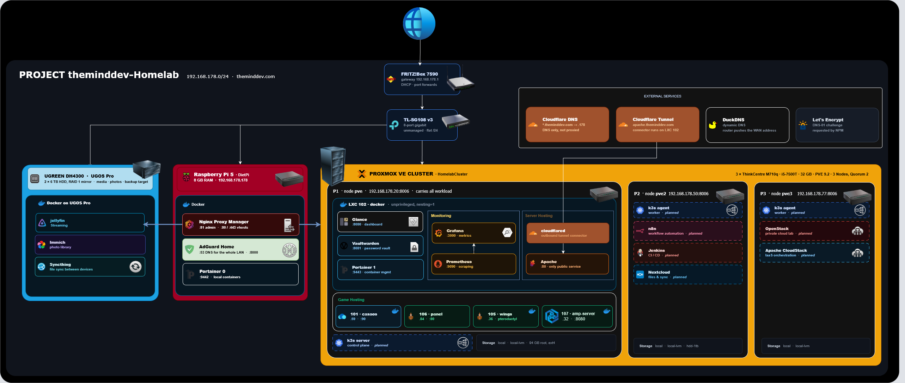
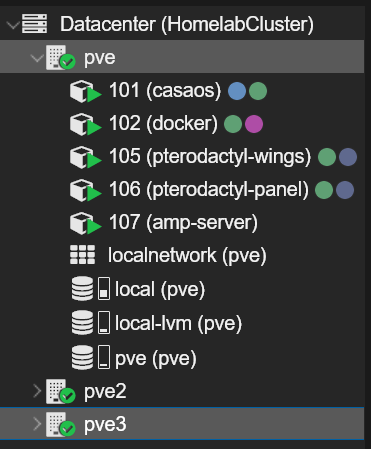

<div align="center">

# theminddev-homelab

**A three-node Proxmox VE cluster, a Raspberry Pi ingress layer and a NAS —
documented so the whole thing can be rebuilt from this repository alone.**


**3 nodes · 12 CPU cores · 96 GB RAM · 5 LXC guests · 16 proxied hostnames · 33 W**

[Architecture](#architecture) · [Hardware](#the-hardware) ·
[Services](#services) · [Wiki](docs/) · [Runbooks](runbooks/) ·
[Limitations](#known-limitations)

</div>

---

## Why this repository exists

Three reasons, in order of honesty.

**It is my operational memory.** When a container dies at 2 a.m. or a node has
to be rebuilt, I do not want to reconstruct from browser history what I did
eight months ago. Every runbook here is written for me, first, on a bad day.

**It is where the concepts became concrete.** Virtualisation, containerisation,
clustering and quorum, reverse proxying, DNS, certificate issuance, backups and
monitoring stop being lecture slides once you have broken them yourself at home
and had to fix them before anyone noticed.

**It is a reference I keep needing.** The difference between an LXC container
and a Docker container. Why `pct enter` exists and `qm enter` does not. Which
`vzdump` mode costs downtime. That material is in [`docs/`](docs/), written the
way I wish it had been explained to me.

---

## Architecture


 

*Editable source: [`diagrams/homelab.drawio`](diagrams/homelab.drawio)*

### How a request reaches a service

**From inside the LAN.** `grafana.theminddev.com` resolves through a public
wildcard `A` record to `192.168.178.178`, the reverse proxy on the Raspberry Pi.
The record is set to *DNS only* in Cloudflare, so the address handed out is an
RFC1918 address: routable on the LAN, useless from outside. Nginx Proxy Manager
terminates TLS with a real Let's Encrypt certificate, issued over the DNS-01
challenge, and forwards to the service.

**No inbound port is open for any of this**, not even for certificate renewal.

**From the internet.** Exactly one hostname is published,
`apache.theminddev.com`, through a Cloudflare tunnel. `cloudflared` runs in
LXC 102 and opens an *outbound* connection to Cloudflare, so there is no inbound
firewall rule at all.

The full path, the headers that break things, and the diagnostic order are in
[`docs/05-networking-dns-tls.md`](docs/05-networking-dns-tls.md).

---

## The hardware

| | Role | Address | Specification |
|---|---|---|---|
| **P1** `pve` | Proxmox node — carries all workload | `192.168.178.20:8006` | ThinkCentre M710q · i5-7500T (4C) · 32 GB · 94 GB ext4 |
| **P2** `pve2` | Proxmox node | `192.168.178.50:8006` | same · plus `hdd-1tb` storage |
| **P3** `pve3` | Proxmox node | `192.168.178.77:8006` | same · no guests, quorum vote |
| **Pi** | Ingress and LAN DNS | `192.168.178.178` | Raspberry Pi 5 · 8 GB · DietPi · Docker |
| **NAS** | Storage, media, backup target | `192.168.178.49` | UGREEN DH4300 · UGOS Pro · 2 × 6 TB RAID 1 |
| **Router** | Gateway, DHCP, DynDNS | `192.168.178.1` | FRITZ!Box 7590 |
| **Switch** | | | TP-Link TL-SG108 v3 · 8-port gigabit · unmanaged |

Flat `/24`, no VLANs, static addressing throughout. AdGuard Home is the DNS
resolver for every device on the network.

### The cluster



`HomelabCluster`, three corosync votes, two needed for quorum. One node can fail
or be taken down for maintenance without the cluster losing `/etc/pve`.

**All guests are LXC containers. There is not a single VM.** The consequence is
that there is no live migration: a container is stopped and restarted on the
target node. The reasoning, and the point at which that rule will have to be
revisited, is in [`docs/04-lxc-vs-vm.md`](docs/04-lxc-vs-vm.md).

<br clear="right">

---

## Services


*The dashboard at [`compose/glance/glance.example.yml`](compose/glance/glance.example.yml).
It answers one question — is anything red — which is why it gets looked at, and
why it sits alongside Grafana rather than being replaced by it.*

### Ingress


*Sixteen hostnames, every one on a Let's Encrypt certificate, every one online.
The destinations are all RFC1918 addresses. Nothing in this list is reachable
from the internet — the certificates were issued over the DNS-01 challenge, so
not one of them required an open inbound port.*


That padlock is on a service that lives entirely inside the LAN, on a name that
resolves publicly to an address nobody outside can route to. It is the whole
DNS-01 argument in one screenshot.

<br clear="right">

### Raspberry Pi 5 · DietPi · Docker


| Service | Port | Hostname | Role |
|---|---:|---|---|
| Nginx Proxy Manager | 81 admin, 80/443 | `npm.` | reverse proxy, TLS termination, Let's Encrypt DNS-01 |
| AdGuard Home | 53 DNS, 8000 UI | `adguard.` | DNS resolver and filter for the whole LAN |
| Portainer 0 | 9442 | `port0.` | container management |

### P1 `pve` · LXC 102 `docker` · `192.168.178.87`

Unprivileged container with `nesting=1`. The Docker host that carries most of
the lab.


| Service | Port | Hostname | Exposure |
|---|---:|---|---|
| Glance | 8080 | `glance.` | LAN |
| Vaultwarden | 8081 | `vault.` | LAN |
| Portainer 1 | 9443 | `port1.` | LAN |
| Grafana | 3000 | `grafana.` | LAN |
| Prometheus | 9090 | `prom.` | LAN |
| n8n | — | — | LAN |
| pure-ftpd | — | — | LAN |
| Apache | 80 | `apache.` | **internet, via tunnel** |
| cloudflared | — | — | outbound only |

*This is also where the repository and reality disagreed, and the repository
lost: n8n was written down as planned for P2 and is in fact running here. The
inventory has been corrected. That is what happens when documentation is
checked against a screenshot rather than against memory.*

### DNS


*123,095 DNS queries in 24 hours, **38,598 blocked — 31.4%**, 15 ms average
processing time. The top-clients list is every device in the house going through
one resolver, which is the point: network-wide filtering with zero
configuration on any client, including the ones that cannot run software of
their own.*

*It is also the clearest picture of this lab's biggest single point of failure.
Every one of those 123,095 queries went through one container on one Raspberry
Pi.*

### P1 `pve` · game hosting

| Guest | IP | Port | |
|---|---|---:|---|
| LXC 101 `casaos` | `.59` | 90 | CasaOS |
| LXC 106 `panel` | `.84` | 80 | Pterodactyl panel |
| LXC 105 `wings` | `.36` | — | Pterodactyl daemon — runs each server as its own container |
| LXC 107 `amp-server` | `.32` | 8080 | CubeCoders AMP |


*Two managers, four servers: Project Zomboid and Minecraft under Pterodactyl,
Terraria and Space Engineers under AMP. Pterodactyl runs each server as its own
Docker container, so a compromise of one is contained to that container.*

**The port numbers are blurred on purpose.** These are the only services in the
lab behind a WAN port forward, and publishing "this port is open" is the one
thing this repository does not do. The reasoning is in
[`docs/99-security-notes.md`](docs/99-security-notes.md), and the fact that the
rule visibly costs something here is the point of having written it down.

### NAS · UGOS Pro · Docker

| Service | Purpose |
|---|---|
| Jellyfin (`jelly.`) | media server — runs next to the library at `192.168.178.49`, so no network share and no passthrough problem |
| Immich | photo library |
| Syncthing | file sync between devices |

All hostnames are under `theminddev.com`. The machine-readable version of every
table on this page is [`inventory/inventory.yml`](inventory/inventory.yml).

---

## Monitoring


*Node Exporter Full (dashboard 1860) on P1: 25.6% CPU, 27.7% of 31 GiB RAM,
45.2% of the 94 GiB root filesystem, seven days of history. The per-interface
network panel shows `veth101i0` through `veth107i0` — one virtual interface per
LXC guest — and `docker0`, which is the containers inside LXC 102.*


*The same dashboard, further down: NVMe and per-core package temperatures over
the same week. Mean 39-44 °C, peaks to 64 °C, against an 80 °C line. Three
fanless mini PCs stacked in a rack is exactly the arrangement where you want
this graph to exist rather than to assume.*


*Prometheus target health, and an honest picture: **two scrape pools, both
up.** Prometheus itself, and `node_exporter` on P1. P2, P3, the Raspberry Pi,
cAdvisor and the Proxmox API exporter are written into
[`prometheus.yml`](compose/monitoring/prometheus.yml) and are not yet deployed —
they are marked as such in the file. Monitoring one of three nodes is a gap, and
it is listed as one below rather than implied away by a config file that looks
complete.*

Prometheus **pulls**: it reaches out to each target on an interval, so adding a
host means editing `prometheus.yml` and installing an exporter, and never
configuring the new host to know about Prometheus. Retention is 90 days, because
the default 15 is too short to see a slow leak.

The stack, the PromQL that actually gets used, and the honest gap — **nothing
alerts** — are in [`docs/08-monitoring.md`](docs/08-monitoring.md). The scrape
configuration is
[`compose/monitoring/prometheus.yml`](compose/monitoring/prometheus.yml).

---

## Power

<div align="center">


</div>

Measured at a TP-Link Tapo smart plug: **around 33 W** under normal load,
peaking above 50 W, **5.7 kWh** over the month to date, **€1.71**.

Worth measuring for two reasons. It is the running cost of the lab, which is a
real number a homelab should know rather than guess. And it is a crude health
signal: a machine suddenly drawing 20 W more than usual is doing work nobody
asked for.

---

## Documentation

### The wiki — [`docs/`](docs/)

*What things are, and why. Written for the version of me who has forgotten.*

| | Page | What it answers |
|---|---|---|
| 00 | [Glossary](docs/00-glossary.md) | every term used here, defined once |
| 01 | [Docker](docs/01-docker.md) | what a container actually is, the mental model, every command by intent |
| 02 | [Docker Compose](docs/02-docker-compose.md) | the file format, `up` vs `restart`, healthchecks, `.env` |
| 03 | [Proxmox cheat sheet](docs/03-proxmox-cheatsheet.md) | the commands, grouped by intent, with the traps |
| 04 | [LXC or VM](docs/04-lxc-vs-vm.md) | the decision rule, and what it costs to get it wrong |
| 05 | [Networking, DNS and TLS](docs/05-networking-dns-tls.md) | the request path, DNS-01, proxy headers, diagnostic order |
| 06 | [Storage](docs/06-storage.md) | thin provisioning, UID mapping, why RAID is not a backup |
| 07 | [Backup and recovery](docs/07-backup-and-recovery.md) | `vzdump` modes, restoring, and the drill nobody runs |
| 08 | [Monitoring](docs/08-monitoring.md) | the stack, the PromQL that gets used, and the alerting gap |
| 09 | [Linux administration](docs/09-linux-admin.md) | systemd, journald, disks, network, SSH, permissions |
| 10 | [Troubleshooting](docs/10-troubleshooting.md) | organised by **symptom**, because that is what you have |
| 11 | [Hardening](docs/11-hardening.md) | the threat model, what is done, what deliberately is not |
| 99 | [Security notes](docs/99-security-notes.md) | what this repository publishes, and what it never will |

### The runbooks — [`runbooks/`](runbooks/)

*How to do it, step by step, while tired.*

| | Runbook | Time |
|---|---|---|
| 01 | [Create an LXC container](runbooks/01-create-an-lxc-container.md) | 3 min |
| 02 | [**Docker and Portainer on a new LXC**](runbooks/02-portainer-on-a-new-lxc.md) — the full walkthrough | 20 min |
| 03 | [AdGuard Home as the LAN resolver](runbooks/03-adguard-home-dns.md) | 20 min |
| 04 | [Put a service behind Nginx Proxy Manager](runbooks/04-nginx-proxy-manager-vhost.md) | 3 min |
| 05 | [Glance dashboard](runbooks/05-glance-dashboard.md) | 15 min |
| 06 | [Publish one service with a Cloudflare Tunnel](runbooks/06-cloudflare-tunnel.md) | 15 min |
| 07 | [Nextcloud](runbooks/07-nextcloud.md) — *planned, not yet deployed* | 60 min |
| 08 | [Add a node to the Proxmox cluster](runbooks/08-add-a-node-to-the-cluster.md) | 15 min |
| 09 | [The backup restore drill](runbooks/09-backup-restore-drill.md) — quarterly | 30 min |
| 10 | [Prometheus, Grafana and the exporters](runbooks/10-monitoring-stack.md) | 45 min |
| 11 | [Rebuild the lab from zero](runbooks/11-rebuild-from-zero.md) | a weekend |

**Start with [Runbook 02](runbooks/02-portainer-on-a-new-lxc.md)** if you read
one thing. It goes from an empty Proxmox node to a service in a browser with a
real certificate, and every other service here is the same six steps with a
different compose file.

---

## Nextcloud

Called out separately because it is the piece of this lab that is fully designed
and not yet running, and the honesty about that is the point.

[`runbooks/07-nextcloud.md`](runbooks/07-nextcloud.md) is a complete deployment
plan for P2: four containers (app, PostgreSQL, Redis, a dedicated cron runner),
the reverse-proxy configuration that determines whether it works at all, and the
post-install steps that decide whether it is still usable at 500 GB.

The decisions it documents:

- **PostgreSQL over MariaDB** — hardest-tested by upstream, `pg_dump` gives a
  clean restorable file, avoids the `utf8mb4` migration MariaDB instances hit
  years later
- **Redis is not optional in practice** — it is documented as optional, and
  every instance without it eventually produces file-locking errors needing
  manual database intervention
- **A separate cron container** — the default AJAX cron only fires when someone
  loads a page, so on a lightly used instance the background jobs silently never
  run
- **`TRUSTED_PROXIES` scoped to exactly the proxy** — too broad and a client can
  spoof its own address; unset and every log line and rate limit sees the proxy
- **Indices and `bigint` conversion before the instance grows**, not after

The compose file is
[`compose/nextcloud/docker-compose.example.yml`](compose/nextcloud/docker-compose.example.yml),
with the reasoning for each of the four containers written into it.

When it is running on P2, the status header comes off that page and its
expectations become observations.

---

## Repository layout

```text
inventory/
  inventory.yml              hosts, guests, services, addressing - the source of truth
diagrams/
  homelab.drawio             editable architecture diagram
  homelab.png                exported for this README
docs/                        the wiki: what things are and why
runbooks/                    step-by-step procedures
compose/
  <service>/
    docker-compose.example.yml
    .env.example             the real .env is gitignored
scripts/
  check-secrets.sh           pre-commit guard against leaking anything private
  new-lxc.sh                 create a container consistently
  install-docker.sh          Docker + Compose plugin, with log rotation
  backup-all.sh              vzdump wrapper with retention
  health-check.sh            is everything in the inventory answering
assets/
  photos/  screenshots/
```

---

## Planned

Marked with a dashed border in the diagram. None of this is running yet.

| What | Where | Why |
|---|---|---|
| **k3s** server + 2 agents | all three nodes | Proxmox schedules containers per node; k3s adds declarative manifests, self-healing and rescheduling across nodes |
| **Nextcloud** | P2 | files and sync — [runbook already written](runbooks/07-nextcloud.md) |
| **Jenkins** | P2 | CI/CD for my other repositories |
| **OpenStack** | P3 | private cloud lab |
| **Apache CloudStack** | P3 | IaaS orchestration lab |
| **WireGuard** | router | replace the game-server port forwards |
| **Alertmanager** | LXC 102 | nothing notifies me today |

Two honest caveats on that list.

**k3s inside an unprivileged LXC needs extra work.** cgroup delegation, kernel
modules and the storage driver all have to be dealt with. A VM would be the
straightforward route, which conflicts with the LXC-only rule above. That
trade-off has to be made before this gets built.

**OpenStack and CloudStack on a 32 GB i5-7500T are a learning exercise, not a
deployment.** A realistic OpenStack controller wants more RAM than the whole
node has, and running it on Proxmox means nested virtualisation. It goes on P3
as a lab and it is labelled that way on purpose.

---

## Known limitations

Written down deliberately. Knowing the weak spots is half the point of running
the thing, and a homelab repository that lists only strengths is a brochure.

- **Nothing alerts.** Prometheus collects and Grafana draws; nothing tells me
  when something breaks. I find out by looking. This is the largest gap.
- **Only P1 is actually scraped.** `prometheus.yml` describes exporters on P2,
  P3, the Pi and cAdvisor; only P1's `node_exporter` is deployed. The two nodes
  with no workload are also the two nodes with no metrics, which is exactly
  backwards from where a surprise would come from.
- **Game server port forwards are the only direct inbound path into the LAN.**
  Everything else is LAN-only or goes through an outbound tunnel. Replacing them
  with WireGuard on the router is the next task.
- **The Raspberry Pi is a single point of failure.** Ingress and LAN-wide DNS
  both run on it. If it dies, name resolution stops for every device on the
  network.
- **No offsite backup.** RAID 1 on the NAS protects against a dead disk, not
  against fire, theft or a mistaken `rm`. The backups are also unencrypted at
  rest.
- **P1 carries everything.** P2 and P3 hold no workload, so the cluster provides
  quorum and maintenance headroom but no load distribution. That is what the k3s
  plan is meant to fix.
- **No network segmentation.** The switch is unmanaged, so there are no VLANs. A
  compromised IoT device is on the same flat network as the Proxmox API.
- **No 2FA on Proxmox.** The Proxmox API is root over every guest in the lab.
  This is the least defensible item on the list.
- **Provisioning is manual.** Containers are created by hand or by a shell
  script. Ansible or Terraform with the Proxmox provider is the obvious next
  step, and the scripts here are *consistency*, not infrastructure as code.
- **No UPS.** A power cut is an unclean shutdown for all four machines at once.

The threat model behind which of these matter, and the order I would fix them
in, is in [`docs/11-hardening.md`](docs/11-hardening.md).

---

## Security

Private addresses, internal ports and hostnames are published on purpose: they
are RFC1918, not routable from the internet, and worthless to anyone who is not
already inside the network. The hostnames are already in public Certificate
Transparency logs, so hiding them here would be theatre.

The public IP, the IPv6 host addresses, MAC addresses, the DuckDNS hostname, the
WAN port forwards and every credential are not in this repository and never will
be.

The rule is in [`docs/99-security-notes.md`](docs/99-security-notes.md). It is
enforced mechanically rather than by discipline:

```bash
./scripts/check-secrets.sh --install   # once
./scripts/check-secrets.sh --all       # scan everything
```

Every commit is then scanned for public IPv4 addresses, global IPv6 addresses,
MAC addresses, tunnel UUIDs, private keys, token-shaped strings and files named
like key material, and a commit containing one is refused.

A pre-commit hook is opt-in per clone, so the same scan also runs in CI
([`.github/workflows/checks.yml`](.github/workflows/checks.yml)) alongside a
shell syntax check, a YAML parse of every file, and a check that every relative
link and image resolves. A hook can be forgotten; CI cannot.

`shellcheck` runs there too, but **advisory only**. The split is deliberate: a
failing build should mean something is wrong, not that a linter has an opinion
about quoting. The scan that gates a merge is the secret scan, because a leak in
a public repository cannot be taken back.

---

<div align="center">

**[Wiki](docs/) · [Runbooks](runbooks/) · [Compose files](compose/) ·
[Scripts](scripts/) · [Inventory](inventory/inventory.yml)**

MIT · [LICENSE](LICENSE)

</div>
