<div align="center">

# theminddev-homelab

**A three-node Proxmox VE cluster, a Raspberry Pi ingress layer and a NAS —
documented so the whole thing can be rebuilt from this repository alone.**

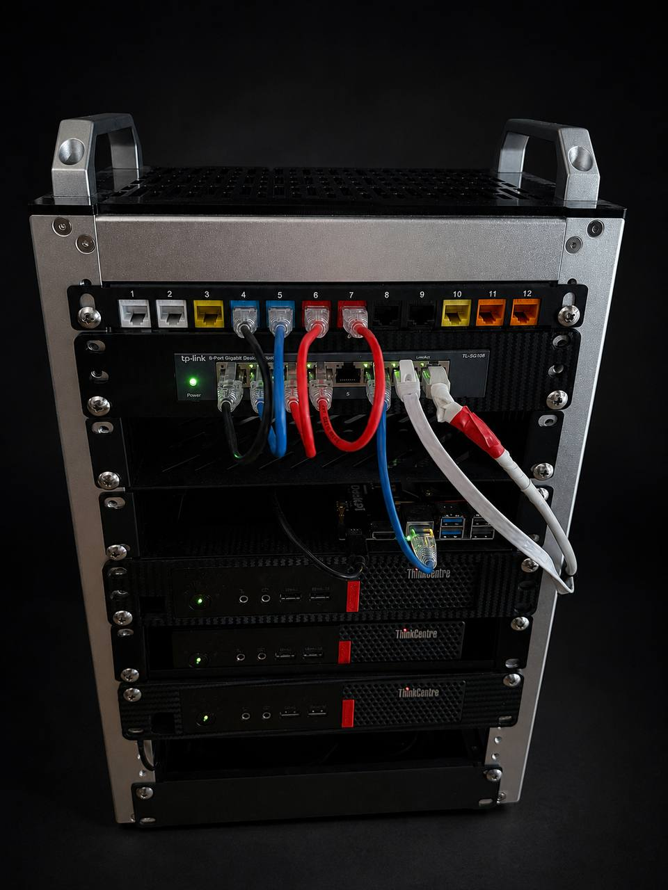


**3 nodes · 12 CPU cores · 64 GB RAM · 6 LXC guests + 1 VM · 2 networks · 16 proxied hostnames · 33 W**

[Architecture](#architecture) · [Hardware](#the-hardware) ·
[Services](#services) · [Wiki](docs/) · [Runbooks](runbooks/) ·
[Limitations](#known-limitations)

</div>

---

## What this repository contains

Complete operational documentation for the infrastructure described below.
The design goal is that the lab could be rebuilt from this repository alone.

| | Contents |
|---|---|
| **[`docs/`](docs/)** | A 22-page technical reference: Docker, Docker Compose, LXC versus VM, Proxmox, storage and thin provisioning, networking, DNS and TLS, backup and recovery, monitoring, Linux administration, troubleshooting, hardening, and a nine-page sequence on network segmentation, bridges, NAT, firewalls, OPNsense and FreeBSD. |
| **[`docs/reports/`](docs/reports/)** | Dated write-ups of changes large enough to have a story, including what broke. |
| **[`runbooks/`](runbooks/)** | 18 step-by-step procedures, each with prerequisites, verification and rollback: creating containers, deploying services, cluster operations, building and sealing the DMZ, backup restore drills and full disaster recovery. |
| **[`compose/`](compose/)** | 11 Docker Compose stacks covering every containerised service, published as templates with credentials externalised. |
| **[`scripts/`](scripts/)** | Operational tooling: container provisioning, Docker installation, backup automation, health checking, and a secret scanner that runs pre-commit and in CI. |
| **[`diagrams/`](diagrams/)** | The full architecture diagram, with editable draw.io source. |
| **[`inventory/`](inventory/inventory.yml)** | A machine-readable inventory of every host, guest, service and address — the single source of truth from which the tables in this README are derived. |

---

## Architecture

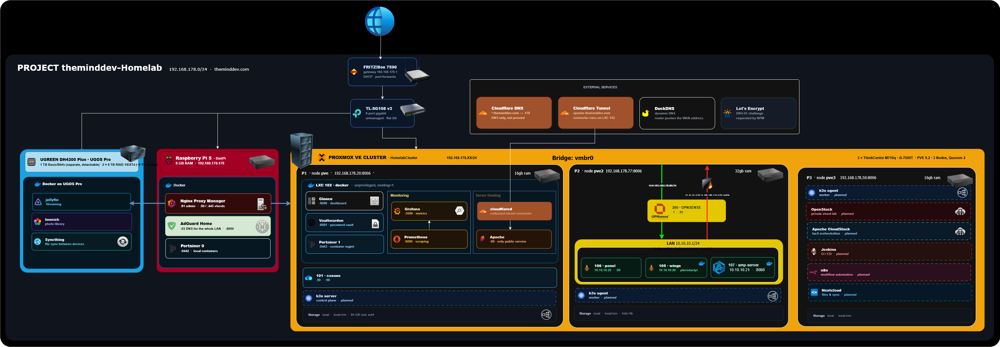

*Editable source: [`diagrams/homelab.drawio`](diagrams/homelab.drawio)*

The lab is built in five layers, each with a defined responsibility.

### 1 · Compute — a three-node Proxmox VE cluster

Three ThinkCentre M710q nodes form `HomelabCluster`: 12 cores and 64 GB of RAM
under a single management plane, with corosync providing three votes and a
quorum of two. One node can fail or be taken down for maintenance without the
cluster losing its configuration filesystem.

Every workload runs in an **unprivileged LXC container** rather than a virtual
machine, with exactly one deliberate exception: the firewall, which is FreeBSD
and therefore cannot be a container on a Linux host. Containers share the host
kernel, which gives sub-second start times and memory consumption proportional
to actual use instead of allocation. The
cost is that they cannot be live-migrated, and that trade-off is documented
rather than omitted.

Docker runs *inside* those containers, giving two distinct layers: the LXC
container is the machine, with an address and a lifetime measured in years; the
Docker containers inside it are the applications, replaced whenever a new image
is published.

### 2 · Ingress — a single point of entry

A Raspberry Pi 5 runs Nginx Proxy Manager, which terminates TLS for all 16
internal hostnames using one Let's Encrypt wildcard certificate and routes each
request to the correct backend by `Host` header. Every service is therefore
reachable by name and over HTTPS, without any service needing to implement TLS
itself.

Certificates are issued over the **DNS-01 challenge**, which proves domain
ownership through a DNS record rather than an HTTP request. As a result, no
inbound port is open for issuance or renewal.

### 3 · Storage — a NAS beside the data

A UGREEN DH4300 Plus holds media, photographs and backup archives across two
volumes: a 1 TB Basic/Btrfs disk kept separate and detachable, and a 2 × 6 TB
RAID 1/EXT4 array (~6 TB usable). Jellyfin, Immich and Syncthing run on the
NAS rather than in the cluster, placing the applications next to the data they
serve and removing both a network share and a hardware-passthrough problem.

### 4 · Isolation — a software DMZ for anything internet-facing

Everything reachable from the internet lives in `10.10.10.0/24`, a Proxmox
bridge created with `bridge-ports none`: a switch with **no physical uplink**.
An OPNsense VM straddles that bridge and the house network and is the only route
between them. A block rule refuses every packet from the segment aimed at
`192.168.178.0/24`.

The design has two halves and needs both. **Separation**, so the exposed machine
has no road to the trusted network, and **a chokepoint**, so the one road it
does have is watched. Two earlier attempts to solve this with firewall rules on
a flat network failed, because rules cannot substitute for a missing path.

OPNsense is not *in* the path of anything else. It hangs off the switch rather
than sitting in line, so the PC, the Pi, the NAS and all three Proxmox nodes
route exactly as they did before, and the migration caused no downtime outside
the game stack.

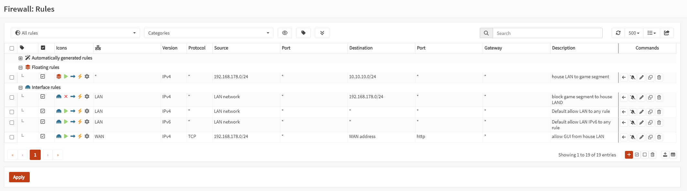

*The whole thing in one screen. The floating rule lets the house reach the
segment; on the LAN interface the block rule sits above the default allows,
which is the only reason it does anything.*

Reasoning: [`docs/12-network-segmentation.md`](docs/12-network-segmentation.md).
Procedures: [runbooks 12 to 18](runbooks/). The full story, including everything
that broke:
[`docs/reports/2026-08-13-dmz-migration.md`](docs/reports/2026-08-13-dmz-migration.md).

### 5 · External services

Cloudflare provides authoritative DNS for the domain and the tunnel through
which exactly one service is published to the internet. AdGuard Home, also on
the Raspberry Pi, is the resolver for every device on the network.

---

### The security property this produces

Internal hostnames resolve **publicly** to an RFC1918 address. Anyone on the
internet can look up `grafana.theminddev.com` and receive `192.168.178.178` —
an address that is not routable across the internet. The name resolves
worldwide and the service is reachable only from the LAN.

Exactly one hostname is published externally, through a Cloudflare tunnel in
which the connector establishes an **outbound** connection and receives requests
over it. There is no inbound firewall rule for it, and no port forward.

The game servers are the honest exception: they use conventional port forwards,
because players come from the internet and always will. **What changed in August
2026 is where those forwards land.** They used to point at a container that was
a peer of the NAS, the password vault and the Proxmox API. They now point at a
firewall, which forwards them into a network segment with no route back.

Verified rather than asserted: an `nmap` sweep of the house from inside the
segment finds nothing, and every reachability probe returns a timeout.

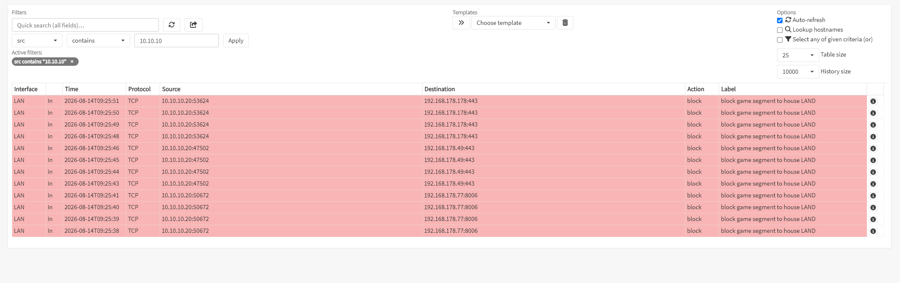

*A game container reaching for AdGuard, the NAS and the Proxmox API. Every row
is `block`.*

Full request paths, the proxy headers that commonly break applications, and the
diagnostic procedure are in
[`docs/05-networking-dns-tls.md`](docs/05-networking-dns-tls.md).

---

## The hardware

| | Role | Address | Specification |
|---|---|---|---|
| **P1** `pve` | Proxmox node — general workload | `192.168.178.20:8006` | ThinkCentre M710q · i5-7500T (4C) · 16 GB · 94 GB ext4 |
| **P2** `pve2` | Proxmox node — the whole game stack and the firewall | `192.168.178.77:8006` | M710q · i5-7400T (4C) · 32 GB · 238 GB NVMe · plus `hdd-1tb` |
| **P3** `pve3` | Proxmox node | `192.168.178.50:8006` | M710q · i5-7500T (4C) · 16 GB · no guests, quorum vote |
| **Firewall** | The only door into the game segment | `192.168.178.60` | OPNsense VM 200 on P2 · 2 GB · 2 cores · 20 GB UFS |
| **Pi** | Ingress and LAN DNS | `192.168.178.178` | Raspberry Pi 5 · 8 GB · DietPi · Docker |
| **NAS** | Storage, media, backup target | `192.168.178.49` | UGREEN DH4300 Plus · UGOS Pro · 1 TB Btrfs + 2 × 6 TB RAID 1/EXT4 |
| **Router** | Gateway, DHCP, DynDNS | `192.168.178.1` | FRITZ!Box 7590 |
| **Switch** | | | TP-Link TL-SG108 v3 · 8-port gigabit · unmanaged |

**Two networks.** The house is a flat `192.168.178.0/24` with no VLANs and
static addressing throughout, and AdGuard Home resolves for every device on it.
The game segment is `10.10.10.0/24` on `vmbr1`, a bridge with no physical
uplink, and it resolves against a public resolver because AdGuard sits on the
other side of the block rule.

| | House LAN | Game segment |
|---|---|---|
| Subnet | `192.168.178.0/24` | `10.10.10.0/24` |
| Bridge | `vmbr0`, real NIC attached | `vmbr1`, `bridge-ports none` |
| Gateway | FRITZ!Box `.1` | OPNsense `10.10.10.1` |
| DNS | AdGuard `.178` | `1.1.1.1` |
| Reaches the other side? | **yes**, stateful, admin only | **no** |

### The cluster

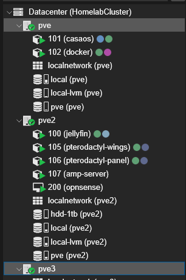

`HomelabCluster`, three corosync votes, two needed for quorum. One node can fail
or be taken down for maintenance without the cluster losing `/etc/pve`.

Every guest is an unprivileged LXC container except VM 200, the OPNsense
firewall. That exception is not a compromise: OPNsense is FreeBSD, a container
shares the host's Linux kernel, and a firewall guarding against a compromised
guest should not borrow the kernel it is protecting. The selection criteria are
in [`docs/04-lxc-vs-vm.md`](docs/04-lxc-vs-vm.md).

<br clear="right">

---

## Services

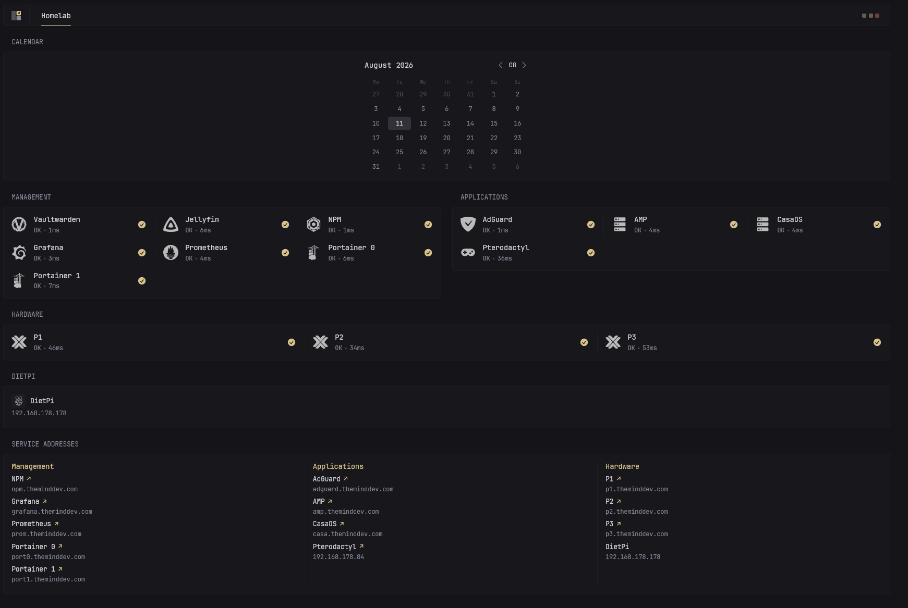

*The dashboard at [`compose/glance/glance.example.yml`](compose/glance/glance.example.yml).
It answers one question — is anything red — which is why it gets looked at
*

### Ingress

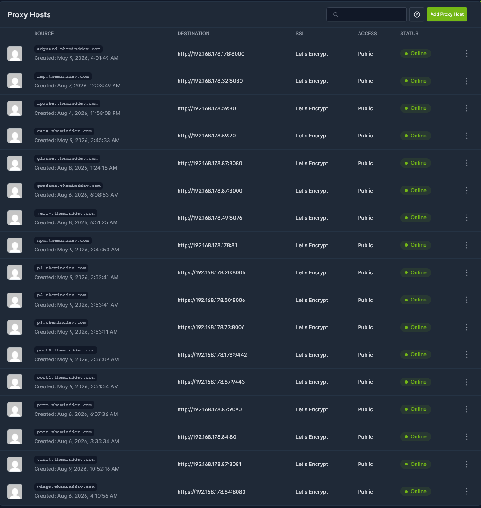

*Sixteen hostnames, every one on a Let's Encrypt certificate, every one online.
The destinations are all RFC1918 addresses. Nothing in this list is reachable
from the internet — the certificates were issued over the DNS-01 challenge, so
not one of them required an open inbound port.*


That padlock is on a service that lives entirely inside the LAN, on a name that
resolves publicly to an address nobody outside can route to. It is the whole
DNS-01 argument in one screenshot.

<br clear="right">

### Raspberry Pi 5 · DietPi · Docker

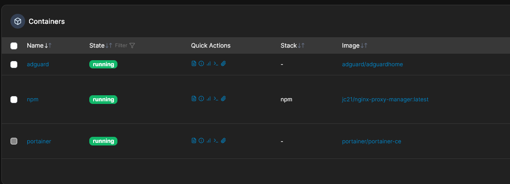

| Service | Port | Hostname | Role |
|---|---:|---|---|
| Nginx Proxy Manager | 81 admin, 80/443 | `npm.` | reverse proxy, TLS termination, Let's Encrypt DNS-01 |
| AdGuard Home | 53 DNS, 8000 UI | `adguard.` | DNS resolver and filter for the whole LAN |
| Portainer 0 | 9442 | `port0.` | container management |

### P1 `pve` · LXC 102 `docker` · `192.168.178.87`

Unprivileged container with `nesting=1`. The Docker host that carries most of
the lab.

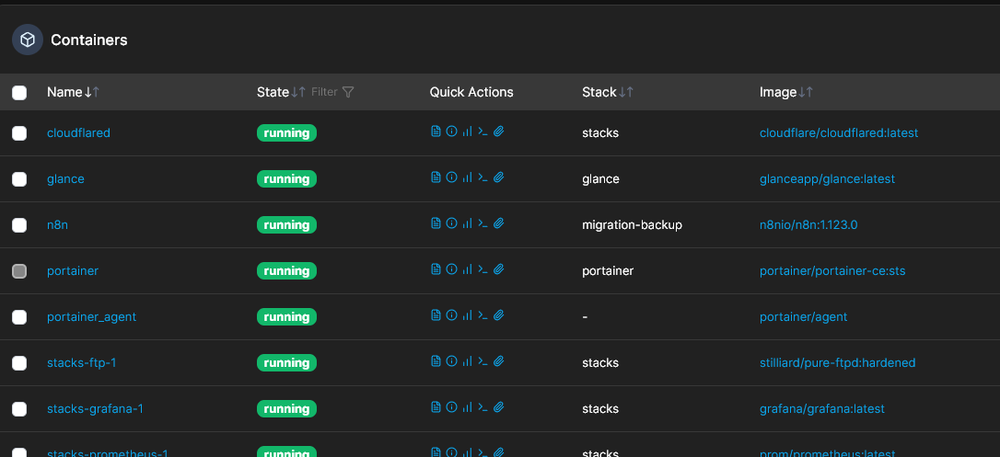

| Service | Port | Hostname | Exposure |
|---|---:|---|---|
| Glance | 8080 | `glance.` | LAN |
| Vaultwarden | 8081 | `vault.` | LAN |
| Portainer 1 | 9443 | `port1.` | LAN |
| Grafana | 3000 | `grafana.` | LAN |
| Prometheus | 9090 | `prom.` | LAN |
| n8n | — | — | LAN |
| pure-ftpd | — | — | LAN |
| Apache | 80 | `apache.` | **internet, via tunnel** |
| cloudflared | — | — | outbound only |


### DNS

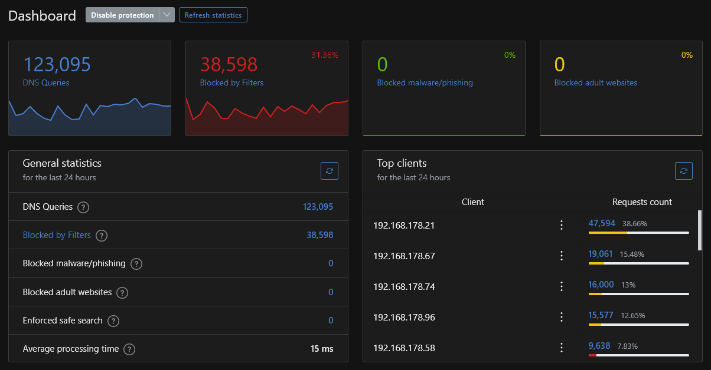

*123,095 DNS queries in 24 hours, **38,598 blocked (31.4%)**, 15 ms average
processing time. Every device on the network resolves through this instance,
which delivers network-wide filtering with no client-side configuration —
including for devices that cannot run filtering software themselves.*

*The same figure describes the primary single point of failure: all 123,095
queries were served by one container on one Raspberry Pi.*

### P2 `pve2` · game hosting, inside the DMZ

Since August 2026 the entire game stack lives in `10.10.10.0/24`, behind
OPNsense, with no route to the house network.

| Guest | IP | Port | |
|---|---|---:|---|
| VM 200 `opnsense` | `10.10.10.1` / `192.168.178.60` | 80 | the firewall, one leg in each network |
| LXC 106 `panel` | `10.10.10.22` | 80 | Pterodactyl panel |
| LXC 105 `wings` | `10.10.10.20` | 9090 | Pterodactyl daemon — runs each server as its own container |
| LXC 107 `amp-server` | `10.10.10.21` | 8080 | CubeCoders AMP |

The panel was moved **into** the segment rather than allowed through it, so no
game-hosting service has any route into the house at all. LXC 101 `casaos`
(`.59`) stays on the house network; it is not internet-facing.

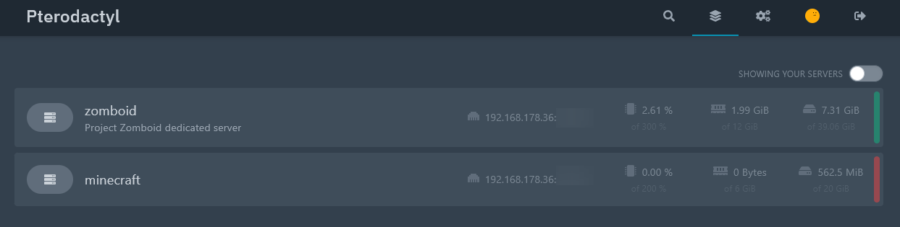

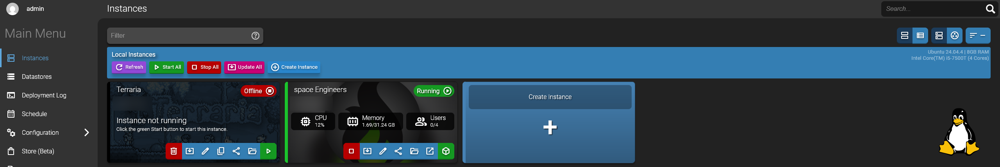

*Two managers, four servers: Project Zomboid and Minecraft under Pterodactyl,
Terraria and Space Engineers under AMP. Pterodactyl runs each server as its own
Docker container, so a compromise of one is contained to that container.*

*Both screenshots predate the migration and show the old `192.168.178.x`
addresses. They are kept as they are; a dated screenshot of a past state is not
a leak.*

**Port numbers are redacted in both screenshots.** These are the only services
behind a WAN port forward, and the publication policy in
[`docs/99-security-notes.md`](docs/99-security-notes.md) excludes any
information about which ports are externally reachable.

### NAS · UGOS Pro · Docker

| Service | Purpose |
|---|---|
| Jellyfin (`jelly.`) | media server — runs next to the library at `192.168.178.49`, so no network share and no passthrough problem |
| Immich | photo library |
| Syncthing | file sync between devices |

All hostnames are under `theminddev.com`. The machine-readable version of every
table on this page is [`inventory/inventory.yml`](inventory/inventory.yml).

---

## Monitoring

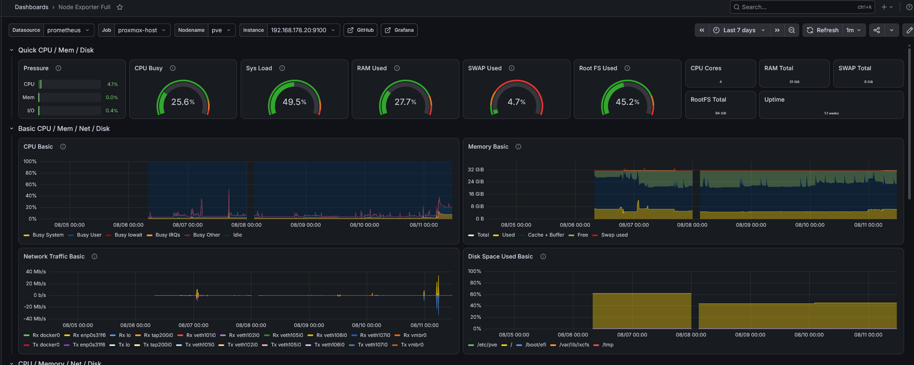

*Node Exporter Full (dashboard 1860) on P1: 25.6% CPU, 27.7% of 31 GiB RAM,
45.2% of the 94 GiB root filesystem, seven days of history. The per-interface
network panel shows `veth101i0` through `veth107i0` — one virtual interface per
LXC guest — and `docker0`, which is the containers inside LXC 102.*

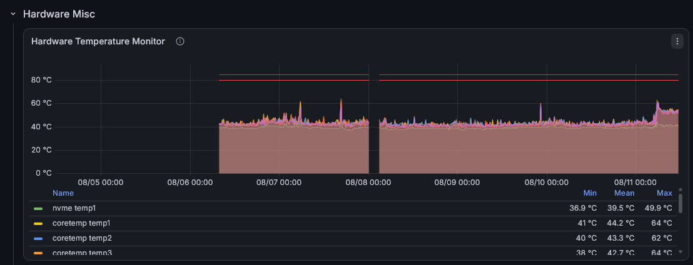

*The same dashboard, further down: NVMe and per-core package temperatures over
the same week. Mean 39-44 °C, peaks to 64 °C, against an 80 °C line. Three
fanless mini PCs stacked in a rack is exactly the arrangement where you want
this graph to exist rather than to assume.*

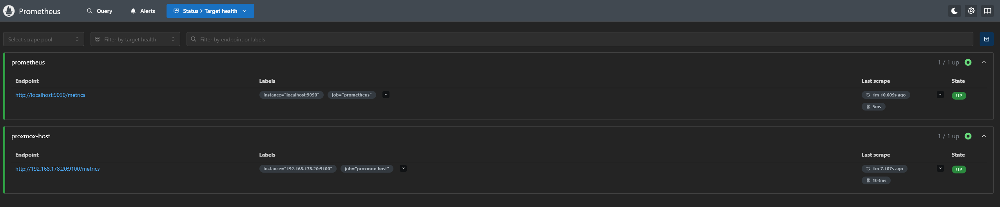

*Prometheus target health: **two scrape pools, both up** — Prometheus itself,
and `node_exporter` on P1. P2, P3, the Raspberry Pi,
cAdvisor and the Proxmox API exporter are written into
[`prometheus.yml`](compose/monitoring/prometheus.yml) and are not yet deployed —
they are marked as such in the file. Monitoring one of three nodes is a gap, and
it is listed as one below rather than implied away by a config file that looks
complete.*

Prometheus **pulls**: it reaches out to each target on an interval, so adding a
host means editing `prometheus.yml` and installing an exporter, and never
configuring the new host to know about Prometheus. Retention is 90 days, because
the default 15 is too short to see a slow leak.

The full stack, the PromQL queries in active use, and the outstanding gap —
**no alerting** — are documented in [`docs/08-monitoring.md`](docs/08-monitoring.md). The scrape
configuration is
[`compose/monitoring/prometheus.yml`](compose/monitoring/prometheus.yml).

---

## Power

<div align="center">
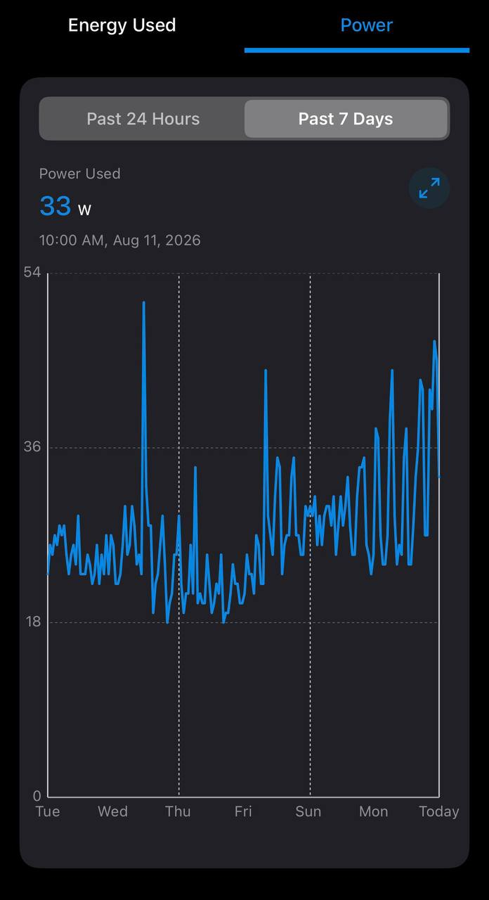
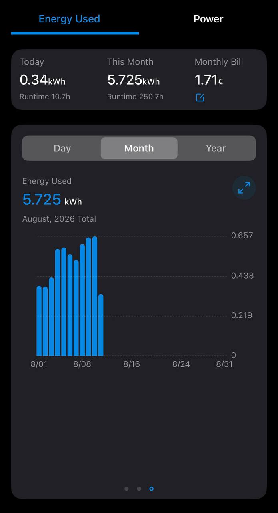
</div>

Measured at a TP-Link Tapo smart plug: **around 33 W** under normal load,
peaking above 50 W, **5.7 kWh** over the month to date, **€1.71**.

Worth measuring for two reasons. It is the running cost of the lab, which is a
real number a homelab should know rather than guess. And it is a crude health
signal: a machine suddenly drawing 20 W more than usual is doing work nobody
asked for.

---

## Documentation

### The wiki — [`docs/`](docs/)

*Reference material: what each component is, and why it was chosen.*

| | Page | What it answers |
|---|---|---|
| 00 | [Glossary](docs/00-glossary.md) | every term used here, defined once |
| 01 | [Docker](docs/01-docker.md) | what a container actually is, the mental model, every command by intent |
| 02 | [Docker Compose](docs/02-docker-compose.md) | the file format, `up` vs `restart`, healthchecks, `.env` |
| 03 | [Proxmox cheat sheet](docs/03-proxmox-cheatsheet.md) | the commands, grouped by intent, with the traps |
| 04 | [LXC or VM](docs/04-lxc-vs-vm.md) | the decision rule, and what it costs to get it wrong |
| 05 | [Networking, DNS and TLS](docs/05-networking-dns-tls.md) | the request path, DNS-01, proxy headers, diagnostic order |
| 06 | [Storage](docs/06-storage.md) | thin provisioning, UID mapping, why RAID is not a backup |
| 07 | [Backup and recovery](docs/07-backup-and-recovery.md) | `vzdump` modes, restoring, and the drill nobody runs |
| 08 | [Monitoring](docs/08-monitoring.md) | the stack, the PromQL that gets used, and the alerting gap |
| 09 | [Linux administration](docs/09-linux-admin.md) | systemd, journald, disks, network, SSH, permissions |
| 10 | [Troubleshooting](docs/10-troubleshooting.md) | organised by **symptom**, because that is what you have |
| 11 | [Hardening](docs/11-hardening.md) | the threat model, what is done, what deliberately is not |
| 99 | [Security notes](docs/99-security-notes.md) | what this repository publishes, and what it never will |

### The runbooks — [`runbooks/`](runbooks/)

*How to do it, step by step, while tired.*

| | Runbook | Time |
|---|---|---|
| 01 | [Create an LXC container](runbooks/01-create-an-lxc-container.md) | 3 min |
| 02 | [**Docker and Portainer on a new LXC**](runbooks/02-portainer-on-a-new-lxc.md) — the full walkthrough | 20 min |
| 03 | [AdGuard Home as the LAN resolver](runbooks/03-adguard-home-dns.md) | 20 min |
| 04 | [Put a service behind Nginx Proxy Manager](runbooks/04-nginx-proxy-manager-vhost.md) | 3 min |
| 05 | [Glance dashboard](runbooks/05-glance-dashboard.md) | 15 min |
| 06 | [Publish one service with a Cloudflare Tunnel](runbooks/06-cloudflare-tunnel.md) | 15 min |
| 07 | [Nextcloud](runbooks/07-nextcloud.md) — *planned, not yet deployed* | 60 min |
| 08 | [Add a node to the Proxmox cluster](runbooks/08-add-a-node-to-the-cluster.md) | 15 min |
| 09 | [The backup restore drill](runbooks/09-backup-restore-drill.md) — quarterly | 30 min |
| 10 | [Prometheus, Grafana and the exporters](runbooks/10-monitoring-stack.md) | 45 min |
| 11 | [Rebuild the lab from zero](runbooks/11-rebuild-from-zero.md) | a weekend |

**Start with [Runbook 02](runbooks/02-portainer-on-a-new-lxc.md)** if you read
one thing. It goes from an empty Proxmox node to a service in a browser with a
real certificate, and every other service here is the same six steps with a
different compose file.

---

## Repository layout

```text
inventory/
  inventory.yml              hosts, guests, services, addressing - the source of truth
diagrams/
  homelab.drawio             editable architecture diagram, 2 pages:
                             the lab, and the DMZ in detail
  homelab-2.png              exported for this README
  homelab.png                the previous export, pre-DMZ
docs/                        the wiki: what things are and why
  12-network-segmentation.md   why a flat network cannot be fixed with rules
  13 .. 20                     addressing, bridges, NAT, firewalls, OPNsense, FreeBSD
  reports/                     dated write-ups of large changes, including what broke
runbooks/                    step-by-step procedures
  12 .. 18                     build the DMZ, seal it, and recover it
compose/
  <service>/
    docker-compose.example.yml
    .env.example             the real .env is gitignored
scripts/
  check-secrets.sh           pre-commit guard against leaking anything private
  new-lxc.sh                 create a container consistently
  install-docker.sh          Docker + Compose plugin, with log rotation
  backup-all.sh              vzdump wrapper with retention
  health-check.sh            is everything in the inventory answering
assets/
  photos/  screenshots/
```

---

## Planned

Marked with a dashed border in the diagram. None of this is running yet.

| What | Where | Why |
|---|---|---|
| **k3s** server + 2 agents | all three nodes | Proxmox schedules containers per node; k3s adds declarative manifests, self-healing and rescheduling across nodes |
| **Nextcloud** | P2 | files and sync — [runbook already written](runbooks/07-nextcloud.md) |
| **Jenkins** | P2 | CI/CD for other repositories |
| **OpenStack** | P3 | private cloud lab |
| **Apache CloudStack** | P3 | IaaS orchestration lab |
| **Alertmanager** | LXC 102 | no automated notification exists today |
| **Egress filtering** | OPNsense | the game segment can currently reach anything outbound |
| **A subnet per service** | OPNsense | wings, AMP and the panel are currently neighbours |
| **Omada ES210X-M2** | rack | 802.1Q, so `vmbr1` becomes a real tagged VLAN and the firewall stops depending on the host it protects |

Two constraints apply to that list.

**k3s inside an unprivileged LXC needs extra work.** cgroup delegation, kernel
modules and the storage driver all have to be dealt with. A VM would be the
straightforward route, which conflicts with the LXC-only rule above. That
trade-off has to be made before this gets built.

**OpenStack and CloudStack on a 16 GB i5-7500T are a learning exercise, not a
deployment.** A realistic OpenStack controller wants more RAM than the whole
node has, and running it on Proxmox means nested virtualisation. It goes on P3
as a lab and it is labelled that way on purpose.

**WireGuard has been dropped from this list.** It was here to replace the game
port forwards, which made sense when the forwards were the whole problem.
Making players join the network is the right model for a private server and the
wrong one for a public one; the DMZ addresses the actual risk, for no recurring
cost and no friction for players. The reasoning is in
[`docs/11-hardening.md`](docs/11-hardening.md).

---

## Known limitations

Documented deliberately. A system's weak points are operational knowledge, and
a repository that lists only strengths is not documentation.

- **No alerting.** Prometheus collects and Grafana visualises; nothing issues a
  notification when a service fails. Failures are detected by inspection. This
  is the largest gap in the system.
- **Only P1 is actually scraped.** `prometheus.yml` describes exporters on P2,
  P3, the Pi and cAdvisor; only P1's `node_exporter` is deployed. The two nodes
  with no workload are also the two nodes with no metrics, which is exactly
  backwards from where a surprise would come from.
- **The game segment has no internal walls.** wings, AMP and the panel share
  `10.10.10.0/24` and are neighbours on one bridge, so traffic between them
  never reaches the firewall. Compromise a game server and you can reach the
  panel; panel admin means code execution on wings. A subnet per service is the
  fix.
- **Egress from the game segment is unrestricted.** The block rule stops it
  reaching the house; nothing stops it reaching the internet. A compromised
  server could mine, join a botnet, or attack third parties from this address.
- **The firewall runs on the machine it protects against.** OPNsense is a VM on
  pve2 and both bridges live on pve2, so root on that host defeats the whole
  arrangement. Only enforcement in hardware the compromised guest does not
  control closes this, which is what a managed switch would buy.
- **A leftover IPv6 allow rule sits under the block rule.** The block is IPv4
  only. Harmless while the segment has no IPv6 address, and an open door around
  it the moment it gets one. Visible in the rules screenshot above.
- **The Raspberry Pi is a single point of failure.** Ingress and LAN-wide DNS
  both run on it. If it dies, name resolution stops for every device on the
  network.
- **No offsite backup.** RAID 1 on the NAS protects against a dead disk, not
  against fire, theft or a mistaken `rm`. The backups are also unencrypted at
  rest.
- **P2 now carries everything that matters.** The whole game stack plus the
  firewall live on one node, so pve2 is a single point of failure for anything
  internet-facing, and P3 still holds no workload. That is what the k3s plan is
  meant to fix.
- **The house network is still flat.** Segmentation exists for the game servers
  and only for them. The switch is unmanaged, so there are no VLANs, and a
  compromised IoT device is still on the same network as the Proxmox API.
- **No 2FA on Proxmox.** The Proxmox API is root over every guest in the lab.
  This is the least defensible item on the list.
- **Provisioning is manual.** Containers are created by hand or by a shell
  script. Ansible or Terraform with the Proxmox provider is the obvious next
  step, and the scripts here are *consistency*, not infrastructure as code.
- **No UPS.** A power cut is an unclean shutdown for all four machines at once.

The threat model that determines which of these matter, and the order in which
they are prioritised, is in [`docs/11-hardening.md`](docs/11-hardening.md).

---

## Security

Private addresses, internal ports and hostnames are published on purpose: they
are RFC1918, not routable from the internet, and worthless to anyone who is not
already inside the network. The hostnames are already in public Certificate
Transparency logs, so hiding them here would be theatre.

The same holds for `10.10.10.0/24`. It is RFC1918, it exists on one bridge
inside one node, and publishing it is what makes the firewall rules legible.
The rules are the interesting part.

The public IP, the IPv6 host addresses, MAC addresses, the DuckDNS hostname, the
WAN port forwards and every credential are not in this repository and never will
be. In the DMZ material that means exactly two things are held back: the public
address, and the **external** port numbers of the game forwards. Every internal
address, every firewall rule, the rule order, the NAT logic and the static route
are published in full, and screenshots have their MAC addresses and the
firewall's exact patch level blanked.

The rule is in [`docs/99-security-notes.md`](docs/99-security-notes.md). It is
enforced mechanically rather than by discipline:

```bash
./scripts/check-secrets.sh --install   # once
./scripts/check-secrets.sh --all       # scan everything
```

Every commit is then scanned for public IPv4 addresses, global IPv6 addresses,
MAC addresses, tunnel UUIDs, private keys, token-shaped strings and files named
like key material, and a commit containing one is refused.

A pre-commit hook is opt-in per clone, so the same scan also runs in CI
([`.github/workflows/checks.yml`](.github/workflows/checks.yml)) alongside a
shell syntax check, a YAML parse of every file, and a check that every relative
link and image resolves. A hook can be forgotten; CI cannot.

`shellcheck` runs there too, but **advisory only**. The split is deliberate: a
failing build should mean something is wrong, not that a linter has an opinion
about quoting. The scan that gates a merge is the secret scan, because a leak in
a public repository cannot be taken back.

---

<div align="center">

**[Wiki](docs/) · [Runbooks](runbooks/) · [Reports](docs/reports/) ·
[Compose files](compose/) · [Scripts](scripts/) ·
[Inventory](inventory/inventory.yml)**

MIT · [LICENSE](LICENSE)

</div>
