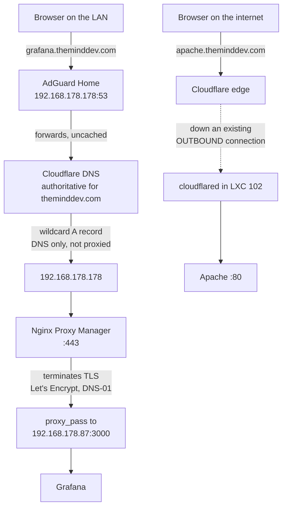

# Networking, DNS and TLS

How a request actually reaches a service here, why almost nothing is exposed,
and the concepts you need in order to change any of it without breaking the
whole network.

---

## The addressing plan

Flat `192.168.178.0/24`. No VLANs. Static addressing for everything in the lab,
DHCP left on for phones and laptops.

| Range | Purpose |
|---|---|
| `.1` | FRITZ!Box — gateway, DHCP, dynamic DNS client |
| `.1` – `.19` | infrastructure |
| `.20` – `.79` | Proxmox nodes (`.20` P1, `.50` P2, `.77` P3) |
| `.80` – `.99` | appliances — NAS, Raspberry Pi (`.178`, historic) |
| `.30` – `.99` | LXC guests |

`192.168.178.0/24` is the factory default of every FRITZ!Box in Germany, which
is worth knowing for two reasons: it identifies nothing about this particular
network, and it collides with roughly every other German homelab if you ever
bridge two of them over a VPN.

**No VLANs is a deliberate simplification, not an oversight.** Segmenting the
network would put the game servers, the IoT devices and the management plane in
separate broadcast domains, which is the correct design. It requires a managed
switch; the TL-SG108 v3 is unmanaged. That is the actual reason, and it is on
the list in the README rather than dressed up as a choice.

---

## The request path



Two paths, and the asymmetry between them is the interesting part.

### From inside the LAN

1. A client asks **AdGuard Home** on the Pi, because the router hands it out as
   the only DNS server via DHCP.
2. AdGuard forwards to Cloudflare, which is authoritative for `theminddev.com`.
3. The wildcard `A` record for `*.theminddev.com` returns **`192.168.178.178`**
   — the Raspberry Pi. The record is set to **DNS only** (grey cloud), so
   Cloudflare returns the address as-is rather than proxying.
4. **Nginx Proxy Manager** on the Pi terminates TLS with a real Let's Encrypt
   certificate and forwards to the service by internal address and port.

**The property worth noticing:** anyone on the internet can resolve
`grafana.theminddev.com` and will get `192.168.178.178`. That address is
RFC1918. It is not routable across the internet. The name resolves for the whole
world and works for nobody outside the LAN.

**No inbound port is open for any of this, including certificate renewal.**

### From the internet

Exactly one hostname is published: `apache.theminddev.com`, through a
**Cloudflare Tunnel**.

`cloudflared` runs in LXC 102 and opens an **outbound** TCP connection to
Cloudflare's edge, then keeps it open. When a request arrives for the published
hostname, Cloudflare sends it back down that existing connection. There is no
inbound firewall rule and no port forward, because nothing is listening.

The trade being made, stated plainly rather than glossed over: **Cloudflare
terminates TLS at their edge and can see the plaintext.** The tunnel is not
end-to-end encrypted to the origin. For a static site that is fine. For anything
sensitive it would not be.

### The honest exception

Game servers use classic **port forwards** on the FRITZ!Box. That is the one
place where the internet reaches the LAN directly, it is the weakest part of the
design, and replacing it with WireGuard on the router is the next task on the
list.

---

## DNS, and why it breaks everything

DNS is the layer where homelab problems concentrate, because everything depends
on it and it fails silently and asymmetrically: the service is fine, the name is
not, and the symptom looks like the service.


*24 hours of real traffic: 123,095 queries, 38,598 blocked (31.4%), 15 ms
average processing time. The top-clients list is every device in the house
resolving through one container.*

*That last sentence is also the risk. Read the same screenshot again as a
failure-mode diagram rather than a statistics page: 123,095 queries, one
container, one Raspberry Pi, no second resolver.*

### The resolution chain here

```
client --> AdGuard Home (.178) --> Cloudflare (1.1.1.1) --> authoritative
             |
             +-- blocklists: ad and tracker domains answered NXDOMAIN
             +-- local rewrites, if any
```

Every device on the LAN uses AdGuard, because the router's DHCP hands out
`192.168.178.178` as the DNS server. That gives network-wide filtering with no
client configuration, and it has one consequence that must be said out loud:

**If the Pi stops, nothing on the network can resolve a name.** Not the
internet, not the internal services, nothing. It is the single point of failure
that matters most in this lab, and a second resolver is the obvious fix.

### Record types worth knowing

| Type | Answers | Note |
|---|---|---|
| `A` | name → IPv4 | the workhorse |
| `AAAA` | name → IPv6 | a stale `AAAA` is a classic "works on my phone but not my laptop" |
| `CNAME` | name → another name | cannot coexist with other records at the same name; cannot be used at a zone apex without provider tricks |
| `TXT` | arbitrary text | how the **DNS-01 challenge** proves domain ownership |
| `MX` | mail servers | |
| `NS` | which servers are authoritative | |

### TTL, and why a change did not take effect

Every record has a **TTL**: how long a resolver may cache it. Change a record
with a 24-hour TTL and half the internet keeps the old answer for a day.

Lower the TTL to 300 seconds *before* you plan to change something, wait for the
old TTL to expire, then change it. Doing it the other way round means waiting
out the old TTL anyway.

### Debugging DNS

```bash
dig grafana.theminddev.com                    # what does my resolver say
dig @1.1.1.1 grafana.theminddev.com           # what does Cloudflare say
dig @192.168.178.178 grafana.theminddev.com   # what does AdGuard say
dig +trace grafana.theminddev.com             # walk the delegation from the root
dig -x 192.168.178.87                         # reverse lookup
resolvectl status                             # what is systemd actually using
```

The diagnostic pattern: **ask three resolvers the same question.** If AdGuard
and Cloudflare disagree, the problem is AdGuard (a blocklist or a rewrite). If
they agree and the browser still fails, the problem is the browser's own cache
or DNS-over-HTTPS.

**DNS over HTTPS in the browser bypasses your resolver entirely.** Firefox and
Chrome ship it enabled in some regions. Symptom: ad blocking stops working and
internal names stop resolving, on one machine, for no visible reason.

---

## TLS, and the DNS-01 challenge

Let's Encrypt has to verify that you control a domain before issuing a
certificate. Two ways:

| Challenge | How it proves control | Requires |
|---|---|---|
| **HTTP-01** | serve a token at `http://domain/.well-known/acme-challenge/...` | **port 80 open from the internet** |
| **DNS-01** | create a `TXT` record at `_acme-challenge.domain` | **API access to your DNS provider** |

This lab uses **DNS-01**, and that choice is the reason the firewall has no
inbound rule at all.

Nginx Proxy Manager is given a Cloudflare API token scoped to *edit DNS for one
zone*. When a certificate is due, NPM creates the `TXT` record, Let's Encrypt
reads it, the certificate is issued, the record is deleted. Nothing inbound
happens at any point.

DNS-01 has a second advantage: it is the **only** way to get a wildcard
certificate. `*.theminddev.com` covers every internal service with one
certificate and one renewal.

The cost: the API token can edit DNS for the zone. It is a credential, it lives
in NPM's data directory, and it is not in this repository.


A padlock on a service that exists only inside the LAN, reached by a name that
the entire internet can resolve and nobody outside can route to. No inbound
port was opened to get that certificate, and none will be opened to renew it.

<br clear="right">

### Certificate Transparency, and why hostnames are not secret

Every certificate a public CA issues is logged in a public, append-only
**Certificate Transparency** log. Anyone can search `crt.sh` for a domain and
read every subdomain that has ever had a certificate.

That is why the hostnames in this repository are published without hesitation:
they were already public the moment the certificate was issued. Hiding them in
the documentation while they sit in a public log would be theatre. A wildcard
certificate does hide individual subdomains from CT, which is a minor secondary
benefit of the wildcard.

---

## Reverse proxy concepts


*Every hostname in the lab, in one table. Read the DESTINATION column: sixteen
RFC1918 addresses. Read the SSL column: sixteen Let's Encrypt certificates, none
of which required an inbound port, because all of them came from one wildcard
issued over DNS-01.*

*The SCHEME in each destination is worth noticing too. Proxmox on `:8006` and
Portainer on `:9442`/`:9443` are `https` because those services speak TLS
themselves; everything else is `http`. Getting that one field wrong is the most
common cause of a 502 from this screen.*

A reverse proxy accepts a connection, decides where it belongs, and forwards it.
One address and one certificate serve every service.

**How it routes:** by the `Host` header. `grafana.theminddev.com` and
`prom.theminddev.com` both resolve to the same IP and hit the same nginx. The
`Host` header is the only thing distinguishing them.

**What it gives you:**

- one TLS certificate instead of one per service
- real certificates for services that have no idea what TLS is
- friendly names instead of `192.168.178.87:3000`
- one place to add authentication, rate limits or access rules

**What it costs:**

- a single point of failure. Every service still runs when NPM stops; none of
  them is reachable by name.
- an extra hop of latency, which is irrelevant on a LAN.

### The headers that break things

The backend sees a connection from the proxy, not from the client. Unless the
proxy tells it:

```nginx
proxy_set_header Host              $host;
proxy_set_header X-Real-IP         $remote_addr;
proxy_set_header X-Forwarded-For   $proxy_add_x_forwarded_for;
proxy_set_header X-Forwarded-Proto $scheme;
```

Symptoms when these are missing or wrong:

| Symptom | Cause |
|---|---|
| every log line shows the proxy's IP | no `X-Forwarded-For` |
| infinite redirect loop | app sees `http`, redirects to `https`, proxy strips it, repeat — no `X-Forwarded-Proto` |
| login redirects to the wrong hostname | no `Host`, so the app builds URLs from its own name |
| "access through untrusted domain" (Nextcloud) | `Host` arriving, but not in `trusted_domains` |
| WebSockets disconnect immediately | missing `Upgrade` / `Connection` headers — NPM has a "Websockets Support" toggle |

**Trusting `X-Forwarded-For` blindly is a vulnerability.** Any client can send
that header. An application must be told *which* proxy is allowed to set it,
which is what Nextcloud's `TRUSTED_PROXIES` is for.

---

## Ports used in this lab

| Port | Service | Exposure |
|---|---:|---|
| 53 | AdGuard Home DNS | LAN |
| 80 / 443 | Nginx Proxy Manager | LAN |
| 81 | NPM admin UI | LAN, never forwarded |
| 8006 | Proxmox web UI (×3 nodes) | LAN |
| 8000 | AdGuard Home UI | LAN |
| 8080 | Glance | LAN |
| 8081 | Vaultwarden | LAN |
| 3000 | Grafana | LAN |
| 9090 | Prometheus | LAN |
| 9100 | node_exporter | LAN |
| 9442 / 9443 | Portainer | LAN |
| 2283 | Immich | LAN |
| 8096 | Jellyfin | LAN |

The WAN port forwards for the game servers are **not** listed. Publishing "these
ports are open" next to an address is the one thing this repository does not do;
see [`99-security-notes.md`](99-security-notes.md).

---

## Diagnostic order

When something is unreachable, work up the stack. It saves guessing.

```bash
# 1. is the host alive at all
ping 192.168.178.87

# 2. is anything listening on the port
nc -zv 192.168.178.87 3000
ss -tlnp | grep 3000                # ON the host

# 3. does the service answer HTTP by IP and port
curl -I http://192.168.178.87:3000

# 4. does the NAME resolve, and to what
dig +short grafana.theminddev.com

# 5. does it answer by name, through the proxy
curl -Ik https://grafana.theminddev.com

# 6. is the certificate valid, and for the right name
openssl s_client -connect grafana.theminddev.com:443 -servername grafana.theminddev.com </dev/null 2>/dev/null | openssl x509 -noout -dates -subject
```

Where it fails tells you who is at fault:

| Fails at | Blame |
|---|---|
| 1 | host down, or wrong address |
| 2 | service not running, or bound to `127.0.0.1` instead of `0.0.0.0` |
| 3 | service running but erroring |
| 4 | DNS: AdGuard, Cloudflare, or a client using DoH |
| 5 | the reverse proxy: wrong upstream, or no proxy host defined |
| 6 | certificate expired, or issued for a different name |

Step 2 catches the most common single cause: a container bound to `127.0.0.1`,
which works perfectly from the host and is invisible from anywhere else.

---

**Next:** [Storage](06-storage.md) — Proxmox storage types, thin provisioning,
and why the disk filled up.
