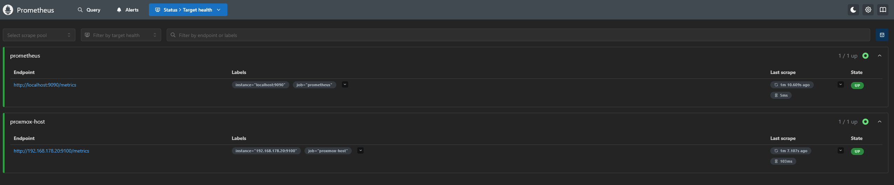

# Monitoring

What is collected, how the pieces fit together, and the honest gap: this lab
observes but does not alert.


---

## The stack

Four components, each doing one thing:

| Component | Answers | Runs on |
|---|---|---|
| **node_exporter** | how is this *machine*? CPU, RAM, disk, network | every host |
| **cAdvisor** | how is each *container*? | LXC 102 |
| **pve-exporter** | how is the *cluster*? guests, quorum, storage | LXC 102 |
| **Prometheus** | stores all of it, over time | LXC 102 |
| **Grafana** | draws it | LXC 102 |
| **Glance** | is anything down, right now? | LXC 102 |
| **Loki + Alloy** | what did the logs say? SSH, containers, firewall | LXC 102 |
| **CrowdSec** | does that look like an attack? (watch only) | LXC 102 |

Glance and Grafana overlap, and both earn their place for a reason worth
stating: **Glance is checked, Grafana is consulted.** Glance answers "is
anything red" in one second from a phone, which means it gets looked at daily.
Grafana answers "why was the disk slow last Tuesday", which is a question you
ask five times a year. A dashboard nobody opens has monitored nothing.

---

## Prometheus pulls

This is the design decision everything else follows from.

Prometheus **reaches out** to every target on an interval and scrapes an HTTP
endpoint that returns plain text metrics. Nothing pushes to Prometheus.

```
Prometheus ---GET http://192.168.178.20:9100/metrics---> node_exporter
           <--- node_cpu_seconds_total{cpu="0",mode="idle"} 148372.9 ---
```

Consequences:

- **Adding a host** means editing `prometheus.yml` and installing an exporter.
  You never configure the target to know about Prometheus.
- **A target that is down is itself a signal.** `up == 0` is a metric. A push
  model cannot distinguish "nothing to report" from "the machine is gone".
- **Everything must be reachable from the Prometheus container.** The most
  common misconfiguration in a homelab is a target of `localhost:9100`, which
  means the Prometheus container itself, not the host.



*`Status > Target health` is the first page to open when a graph goes empty. Two
scrape pools, both UP, last scrape about a minute ago, 5 ms and 103 ms. The
`instance` and `job` labels shown here are attached to every metric the target
produces, which is what makes `up == 0` per-instance possible at all.*

*The screenshot shows the coverage before P2, P3 and pve-exporter were added.
Today all three nodes and the Proxmox API are scraped. The Pi and cAdvisor are
still only a plan in `prometheus.yml`, because a target that is configured and
not installed shows DOWN forever and teaches you to ignore DOWN.*

Short-lived jobs that finish before a scrape are the case pull handles badly.
Pushgateway exists for that; nothing here needs it.

The scrape configuration is
[`compose/monitoring/prometheus.yml`](../compose/monitoring/prometheus.yml).

---

## The data model

A metric is a name, a set of labels, and a number:

```
node_filesystem_avail_bytes{instance="192.168.178.20:9100",mountpoint="/",fstype="ext4"} 40265318400
```

Every distinct combination of labels is a separate **time series**. That matters
because it is how you accidentally destroy a Prometheus: a label whose value is
unbounded (a request ID, a container ID that changes on every restart, a
timestamp) creates a new series every time, and memory grows until it stops.
This is called cardinality explosion and it is the one Prometheus failure mode
that is self-inflicted.

Four metric types:

| Type | Behaviour | Example |
|---|---|---|
| **Counter** | only goes up, resets to 0 on restart | `node_network_receive_bytes_total` |
| **Gauge** | goes up and down | `node_memory_MemAvailable_bytes` |
| **Histogram** | bucketed observations | request durations |
| **Summary** | pre-computed quantiles | rarely worth it |

**A counter is almost never useful raw.** `node_network_receive_bytes_total` is
"bytes since boot", which is a meaningless number. You want its rate.

---

## PromQL, the parts actually used

```promql
# CPU used, as a percentage, per host
100 - (avg by (instance) (rate(node_cpu_seconds_total{mode="idle"}[5m])) * 100)

# memory used, percent
100 * (1 - node_memory_MemAvailable_bytes / node_memory_MemTotal_bytes)

# root filesystem used, percent
100 * (1 - node_filesystem_avail_bytes{mountpoint="/"}
           / node_filesystem_size_bytes{mountpoint="/"})

# disk full in how many hours, at the current rate
predict_linear(node_filesystem_avail_bytes{mountpoint="/"}[6h], 4*3600) < 0

# network throughput, bytes per second
rate(node_network_receive_bytes_total{device!~"lo|veth.*"}[5m])

# is the target up
up == 0

# load average per core
node_load5 / on(instance) count by (instance) (node_cpu_seconds_total{mode="idle"})

# container memory, per container
container_memory_usage_bytes{name!=""}

# how long since the machine booted
time() - node_boot_time_seconds
```

**`rate()` versus `increase()`:** `rate` gives per-second, `increase` gives the
total over the window. Both only work on counters, both handle the reset-to-zero
on restart correctly, and both need a range at least four times the scrape
interval or they return nothing. A 15 s scrape interval means `[1m]` minimum;
`[5m]` is the safe default.

`predict_linear` is the one worth knowing about. "The disk is 85% full" is not
actionable. "The disk will be full in six hours" is.

---

## Grafana


*Dashboard 1860 against `job="proxmox-host"`, `instance="192.168.178.20:9100"`.
Worth reading rather than glancing at: the Network Traffic panel lists
`veth101i0`, `veth102i0`, `veth105i0`, `veth106i0`, `veth107i0` and `docker0`.
Each `vethNNNi0` is the host side of one LXC guest's virtual ethernet pair, and
`docker0` is the bridge for the containers inside LXC 102. The whole topology of
the node is visible in one legend.*

Grafana queries Prometheus and draws it. It stores dashboards, users and data
source definitions in its own database; it stores no metrics.


*Further down the same dashboard: NVMe and per-core temperatures, seven days,
against an 80 °C threshold line. Mean 39-44 °C, peak 64 °C. Worth having as a
panel rather than as an assumption when the hardware is three fanless mini PCs
stacked vertically in a rack with no active airflow.*

Dashboards worth importing rather than building, by ID from grafana.com:

| ID | Dashboard | Needs |
|---|---|---|
| **1860** | Node Exporter Full | node_exporter |
| **193** | Docker and system monitoring | cAdvisor |
| **10347** | Proxmox via pve-exporter | pve-exporter |
| **13639** | Logs / Loki | Loki, not installed here |

1860 is the one to start with. It is comprehensive to the point of being
overwhelming, and it is a good way to learn what node_exporter actually exposes.

**Provision the data source in a file, not by clicking.** A Grafana whose
configuration only exists in its own volume is a Grafana you have to reconfigure
by hand after every rebuild:

```yaml
# compose/monitoring/provisioning/datasources/prometheus.yml
apiVersion: 1
datasources:
  - name: Prometheus
    type: prometheus
    access: proxy
    url: http://prometheus:9090
    isDefault: true
```

Note the URL: `prometheus:9090`, the **service name** on the compose network,
not an IP and not `localhost`.

---

## Glance

A YAML file that renders a page of health checks and bookmarks. Configuration:
[`compose/glance/glance.example.yml`](../compose/glance/glance.example.yml).

A Glance `monitor` widget does an HTTP request and colours a tile by the
response. That is a **liveness** check, not a correctness check: a service can
return 200 while being completely broken internally. It catches the failure that
actually happens in a homelab, which is a container that stopped and nobody
noticed for two weeks.

The two configuration details that cause every Glance support question:

- **`allow-insecure: true`** for anything with a self-signed certificate, which
  is Proxmox on `:8006` and Portainer on `:9443`.
- A service that returns **401 when not logged in is healthy**. Nginx Proxy
  Manager's admin UI does this. Without handling it, the tile is permanently red
  and you learn to ignore red tiles, which defeats the point.

---

## What is monitored here

| Target | Exporter | Port |
|---|---|---:|
| P1, P2, P3 | node_exporter, installed with apt on the host | 9100 |
| LXC 102 | node_exporter in a container | 9100 |
| Raspberry Pi | node_exporter in a container | 9100 |
| containers on LXC 102 | cAdvisor | 8085 |
| the cluster | prometheus-pve-exporter | 9221 |
| CrowdSec | built-in metrics | 6060 |
| AdGuard Home (Pi) | adguard-exporter | 9618 |

**cAdvisor inside an unprivileged LXC sees less than on bare metal.**
Per-container CPU and memory work. Some disk I/O statistics do not, because the
container cannot read the host's block device accounting. That is a known
limitation of running the monitoring stack inside a container rather than on the
node, not a misconfiguration.

---

## Security logs: watch, don't block

A small "who knocks on the door" setup, files in
[`compose/security/`](../compose/security/). It **only watches and reports.
Nothing in it blocks traffic.**

| Container | Job | Memory cap |
|---|---|---:|
| **Loki** | log database, keeps 30 days, Docker network only | 512 MB |
| **Alloy** | collects the LXC 102 journal (SSH logins + every container's log, Apache lines split into IP/method/path/status/user agent) and the OPNsense firewall log (syslog on UDP 1514). Adds country/city of the sender from the free DB-IP database | 320 MB |
| **CrowdSec** | reads those logs back from Loki and spots SSH brute force, web scans, port scans | 256 MB |
| **adguard-exporter** | turns AdGuard stats into Prometheus numbers, read-only | 64 MB |

Real use is about half the caps. There are two dashboards, plus the general
**Homelab Overview** (node up/down tiles, gauges, per-node bars, guests,
storage, a security summary row and a Raspberry Pi + NAS row):

- **Homelab Security** (the simple one): six big numbers, a dark world map
  with game traffic (blue) and website visitors (orange), top countries,
  traffic over time, what they reach, top visitors, a live feed and a
  "guards" strip (SSH, web attack probes, CrowdSec, AdGuard). Explanations
  live in each panel's ⓘ, not in a text box.
- **Homelab Security — Advanced**: every detail. Firewall per server, port
  and protocol, blocked sources, website status codes, paths, user agents,
  bots and attack probes, SSH logins, CrowdSec health and scenarios, AdGuard
  clients, domains, query types and upstreams, and log pipeline health.

All three are generated by a small Python script instead of being edited by
hand in Grafana, so a change is a diff, not a click-hunt. Every dashboard
gets the same link bar at the top.

**Website visitors on the map.** The website is reached through the
Cloudflare tunnel, so Apache only ever saw cloudflared's Docker IP. Apache
now uses `mod_remoteip` and reads the real visitor IP from Cloudflare's
`CF-Connecting-IP` header, trusted only from Docker networks (cloudflared),
never from the LAN. It also logs the `combined` format. The three changes to
the default `httpd.conf` are in
[`compose/apache/httpd-remoteip.conf`](../compose/apache/httpd-remoteip.conf).
Alloy then labels those lines `job="apache"` and adds the location, the same
way as for the firewall log.

Four things the first live look at that dashboard taught:

- **Pick a basemap that needs no key.** Grafana's default basemap (CARTO)
  now wants an API key and just says "API KEY REQUIRED". OpenStreetMap
  (`osm-standard`) works; the dashboard now uses ESRI's free dark tiles
  (an XYZ layer, no key), which suit a dark dashboard better.
- **Count game traffic on the DMZ side, not on WAN.** OPNsense logs an
  internet game connection where it leaves towards the DMZ (DMZ interface,
  direction *out*). Read it there and every connection is counted once.
  Also logging the WAN rules would count each connection twice, so don't.
- **Firewall panels only count traffic from the internet.** Without a filter
  on the source IP, "blocked" fills up with house-LAN noise (NetBIOS, mDNS,
  Syncthing broadcasts). The queries drop private source ranges
  (`10/8`, `172.16/12`, `192.168/16`, `127/8`). "Blocked from internet" at
  0 is normal when the router in front only forwards the game ports.
- **Bar gauges and pies from Loki: show every row.** A Loki "top N" query
  run as an *instant* query reaches Grafana as one table with a row per
  country (or protocol, or kind). With the default settings a bar gauge or
  pie then reduces that table to one number and draws a single bar, e.g.
  "Top countries" showing just "65" with no names. Setting the panel to show
  all values (`reduceOptions.values: true`, `fields: "/^Value/"`) draws one
  bar per row with its name. Prometheus panels return one series per label
  and do not need this.

Choices worth stating:

- **No bouncer.** CrowdSec writes "4h ban" decisions into its own database,
  and nothing acts on them. Blocking is a separate, later decision.
- **No online API.** Nothing is sent to crowdsec.net.
- **Private IPs are whitelisted** by CrowdSec. LAN SSH attempts show on the
  dashboard but don't raise alerts. Behind a Cloudflare tunnel, Apache only
  sees a Docker IP as the visitor unless the real IP is passed through with
  `mod_remoteip` (done, see above). Without it, web scenarios stay quiet.
- **OPNsense side:** *System → Settings → Logging → Remote*, UDP, application
  `filterlog` only, rfc5424, target LXC 102 port 1514. Pass rules only show up
  if the rule has *Log packets* ticked.
- **GeoIP file is not in Git.** It's downloaded by hand from DB-IP ("IP to
  City Lite", CC BY 4.0) into `/opt/security/geoip/` and refreshed monthly.

Run it in the **same compose project** as the monitoring stack so Grafana and
Prometheus reach it by name, and never with `--remove-orphans`:

```bash
docker compose -p stacks -f security.yml up -d
```

---

## The gap: nothing alerts

Prometheus collects. Grafana draws. Glance shows. **Nothing tells me.**

I find out something is broken by looking at a dashboard, which means I find out
when I look, which is not when it broke.

This is written in the README's known limitations and it is the most obviously
missing piece of the whole lab. The fix is Alertmanager, and the rules that
matter are not complicated:

```yaml
# rules/basic.yml - not yet deployed
groups:
  - name: basic
    rules:
      - alert: HostDown
        expr: up == 0
        for: 5m
        labels: {severity: critical}
        annotations:
          summary: "{{ $labels.instance }} has not responded for 5 minutes"

      - alert: DiskWillFill
        expr: predict_linear(node_filesystem_avail_bytes{mountpoint="/"}[6h], 24*3600) < 0
        for: 30m
        labels: {severity: warning}
        annotations:
          summary: "{{ $labels.instance }} root filesystem full within 24h"

      - alert: ThinPoolNearlyFull
        expr: node_filesystem_avail_bytes{mountpoint="/"} / node_filesystem_size_bytes{mountpoint="/"} < 0.10
        for: 15m
        labels: {severity: critical}

      - alert: MemoryPressure
        expr: node_memory_MemAvailable_bytes / node_memory_MemTotal_bytes < 0.10
        for: 15m
        labels: {severity: warning}
```

**`for:` is what separates a useful alert from noise.** Without it, a single
failed scrape pages you. With `for: 5m`, the condition has to hold across
several evaluations. An alerting system people mute is worse than no alerting
system, because it produces the *feeling* of coverage.

---

## Power


Measured at a TP-Link Tapo smart plug: around **33 W** under normal load, with
brief peaks above 50 W, and **5.7 kWh over the month to date**.

Worth measuring for two reasons. It is the running cost of the lab, which is a
real number a homelab should know rather than guess. And it is a crude health
signal: a machine that suddenly draws 20 W more than usual is doing work nobody
asked it to do.

This is not scraped into Prometheus. A Tapo exporter would put it on the same
dashboards as everything else and is a small, satisfying project.

---

**Next:** [Linux administration](09-linux-admin.md) — the systemd, journald and
SSH commands underneath all of the above.
