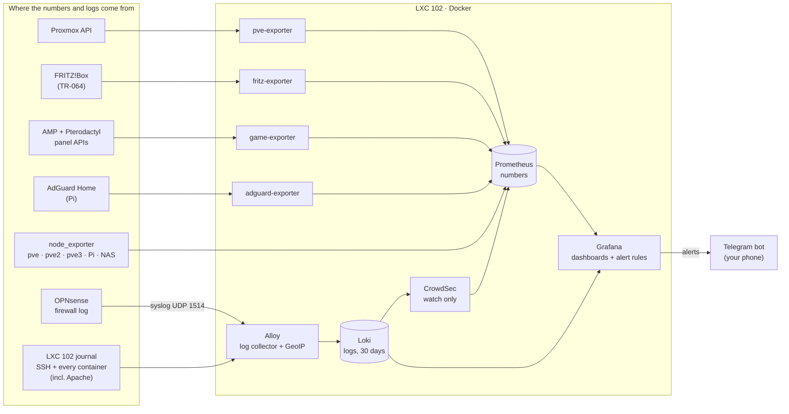

# Monitoring

What is watched, how the pieces fit together, and where the details live. This
page is the map; three pages next to it hold the depth:

| Page | What it covers |
|---|---|
| **this page** | the stack, how Prometheus works, the PromQL that gets used, what is monitored |
| [23 · Logs and security monitoring](23-logs-and-security-monitoring.md) | Loki, Alloy, CrowdSec, the firewall log, GeoIP, the world map |
| [24 · Alerting](24-alerting.md) | Grafana alert rules, Telegram, quiet hours, and every way an alert can lie |
| [25 · Dashboards as code](25-dashboards-as-code.md) | why the dashboards are generated by a script, and the Grafana traps |

How to build all of it, step by step: runbooks
[10](../runbooks/10-monitoring-stack.md),
[21](../runbooks/21-logs-and-crowdsec.md),
[22](../runbooks/22-real-visitor-ip-behind-a-tunnel.md),
[23](../runbooks/23-alerts-to-telegram.md),
[24](../runbooks/24-fritzbox-monitoring.md),
[25](../runbooks/25-game-server-monitoring.md) and
[26](../runbooks/26-test-grafana-changes-safely.md).
The story of how it was built in one evening, including what broke:
[the October 2026 report](reports/2026-10-08-monitoring-security-alerting.md).


---

## The stack

Every box is one container (or one small package) doing one job.



| Component | Answers | Runs on |
|---|---|---|
| **node_exporter** | how is this *machine*? CPU, RAM, disks, network, temperatures | every Proxmox node (apt), the Pi and the NAS (container) |
| **pve-exporter** | how is the *cluster*? every node, VM, LXC and storage, read-only | LXC 102 |
| **fritz-exporter** | how is the *internet line and the home network*? | LXC 102 |
| **game-exporter** | which *game servers* run, players, load, uptime | LXC 102 (our own ~150-line script) |
| **adguard-exporter** | how is *DNS*? queries, blocked share, top clients | LXC 102 |
| **Prometheus** | stores all the numbers, over time | LXC 102 |
| **Alloy** | collects the *logs*: SSH, every container, the firewall | LXC 102 |
| **Loki** | stores the logs, 30 days | LXC 102 |
| **CrowdSec** | does a log line look like an attack? (watch only) | LXC 102 |
| **Grafana** | draws everything, and runs the alert rules | LXC 102 |
| **Glance** | is anything down, right now? | LXC 102 |

Two things that look like overlap and are not:

**Glance is checked, Grafana is consulted.** Glance answers "is anything red"
in one second from a phone, which means it gets looked at daily. Grafana answers
"why was the disk slow last Tuesday", which is a question you ask five times a
year. A dashboard nobody opens has monitored nothing.

**Numbers and logs are different tools.** Prometheus stores *numbers over time*
(CPU at 14:03 was 12 %). Loki stores *text lines* (at 14:03 someone from
203.0.113.10 tried to log in as `admin`). "How busy" is a Prometheus question,
"who and what exactly" is a Loki question. Grafana can show both on one page.

Memory used by the whole stack on LXC 102 is roughly 1 GB; every container has a
memory cap in its compose file.

---

## Prometheus pulls

This is the design decision everything else follows from.

Prometheus **reaches out** to every target on an interval and scrapes an HTTP
endpoint that returns plain text metrics. Nothing pushes to Prometheus.

```
Prometheus ---GET http://192.168.178.20:9100/metrics---> node_exporter
           <--- node_cpu_seconds_total{cpu="0",mode="idle"} 148372.9 ---
```

Consequences:

- **Adding a host** means editing `prometheus.yml` and installing an exporter.
  You never configure the target to know about Prometheus.
- **A target that is down is itself a signal.** `up == 0` is a metric. A push
  model cannot distinguish "nothing to report" from "the machine is gone".
- **Everything must be reachable from the Prometheus container.** The most
  common misconfiguration in a homelab is a target of `localhost:9100`, which
  means the Prometheus container itself, not the host.
- **An exporter is just a translator.** pve-exporter, fritz-exporter and
  game-exporter each ask some API (Proxmox, the router, the game panels) and
  print the answer in Prometheus's text format. That is also why writing one
  yourself is small: the game-exporter is ~150 lines of standard-library Python.


*`Status > Target health` is the first page to open when a graph goes empty.
This screenshot is from the very start, with two scrape pools. Today there are
ten jobs (below), all UP. The `instance` and `job` labels shown here are
attached to every metric the target produces, which is what makes `up == 0`
per-instance possible at all.*

Short-lived jobs that finish before a scrape are the case pull handles badly.
Pushgateway exists for that; nothing here needs it.

The scrape configuration is
[`compose/monitoring/prometheus/prometheus.yml`](../compose/monitoring/prometheus/prometheus.yml),
commented line by line.

---

## The data model

A metric is a name, a set of labels, and a number:

```
node_filesystem_avail_bytes{node="pve",mountpoint="/",fstype="ext4"} 40265318400
```

Every distinct combination of labels is a separate **time series**. That matters
because it is how you accidentally destroy a Prometheus: a label whose value is
unbounded (a request ID, a container ID that changes on every restart, a
timestamp, a visitor's IP address) creates a new series every time, and memory
grows until it stops. This is called cardinality explosion and it is the one
Prometheus failure mode that is self-inflicted. (Loki has the same rule for its
labels, which is why visitor IPs there are *structured metadata*, not labels;
see [docs/23](23-logs-and-security-monitoring.md).)

**Give your targets human names.** This lab adds a `node` label in
`prometheus.yml` (`node: pve`, `node: pi`, ...). Every dashboard and alert then
says "pi is DOWN" instead of "192.168.178.178:9100 is DOWN".

Four metric types:

| Type | Behaviour | Example |
|---|---|---|
| **Counter** | only goes up, resets to 0 on restart | `node_network_receive_bytes_total` |
| **Gauge** | goes up and down | `node_memory_MemAvailable_bytes` |
| **Histogram** | bucketed observations | request durations |
| **Summary** | pre-computed quantiles | rarely worth it |

**A counter is almost never useful raw.** `node_network_receive_bytes_total` is
"bytes since boot", which is a meaningless number. You want its rate.

---

## PromQL, the parts actually used

```promql
# CPU used, 0..1, per node
1 - avg by (node) (rate(node_cpu_seconds_total{mode="idle"}[5m]))

# memory used, 0..1
1 - node_memory_MemAvailable_bytes / node_memory_MemTotal_bytes

# root filesystem used, 0..1
1 - node_filesystem_avail_bytes{mountpoint="/"} / node_filesystem_size_bytes{mountpoint="/"}

# disk full within 7 days, at the growth rate of the last 6 hours (1 = yes)
predict_linear(node_filesystem_avail_bytes{mountpoint="/"}[6h], 7*86400) < bool 0

# network throughput, bytes per second
rate(node_network_receive_bytes_total{device!~"lo|veth.*"}[5m])

# is the target up (1) or not (0)
up

# load average per core (above 1 = work is waiting for the CPU)
node_load5 / on (node) count by (node) (node_cpu_seconds_total{mode="idle"})

# how long since the machine booted, seconds
time() - node_boot_time_seconds

# share of time tasks had to WAIT for CPU / memory / disk ("is it struggling?")
rate(node_pressure_io_waiting_seconds_total[5m])

# one row per Proxmox guest, with its name (pve-exporter keeps the name in a
# separate "info" metric; group_left copies it over)
pve_cpu_usage_ratio * on (id) group_left(name, node) pve_guest_info
```

**`rate()` versus `increase()`:** `rate` gives per-second, `increase` gives the
total over the window. Both only work on counters, both handle the reset-to-zero
on restart correctly, and both need a range at least four times the scrape
interval or they return nothing. A 15 s scrape interval means `[1m]` minimum;
`[5m]` is the safe default. In Grafana, `[$__rate_interval]` picks a good one
automatically.

**`> 0.9` versus `> bool 0.9`:** without `bool` a comparison is a *filter*: it
returns the series only when the condition is true, and nothing otherwise. With
`bool` it always returns a number, 1 or 0. Alert rules here are written with
`bool` on purpose; [docs/24](24-alerting.md#the-traps) explains the rule that
could never fire because of a missing `bool`.

`predict_linear` is the one worth knowing about. "The disk is 85% full" is not
actionable. "The disk will be full in six days" is.

---

## Grafana

Grafana queries Prometheus and Loki and draws them. It stores users and its own
settings in its database; it stores **no metrics and no logs**.

Everything Grafana knows about this lab comes from **files**, not clicks:

| Folder ([`compose/monitoring/grafana/`](../compose/monitoring/grafana/)) | What it holds |
|---|---|
| `provisioning/datasources/` | Prometheus and Loki, each with a fixed `uid` the dashboards refer to |
| `provisioning/dashboards/` | "load every JSON file from this folder into the folder Homelab" |
| `provisioning/alerting/` | the alert rules, the Telegram contact points, the routing and quiet hours, the message template |
| `dashboards/` | the dashboard JSON, **generated** by [`scripts/grafana/gen_all.py`](../scripts/grafana/gen_all.py) |

Delete the Grafana container and its volume, start it again, and every data
source, dashboard and alert is back. A Grafana whose configuration only exists
in its own database is a Grafana you rebuild by hand.

**Note the data source URLs:** `http://prometheus:9090` and `http://loki:3100`,
the **service names** on the compose network, not an IP and not `localhost`.

### The four dashboards

All four are in the **Homelab** folder and share one link bar at the top.

| Dashboard | Question it answers | Highlights |
|---|---|---|
| **Homelab · Overview** | is everything up, full, hot? | node UP/DOWN tiles, cluster gauges, per-node bars (click → Hosts), internet line (FRITZ!Box), Pi + NAS, game servers, every guest with backup status, storage "full in N days", security summary |
| **Homelab · Hosts** | what exactly is going on with *this* machine? | a switch at the top (`pve`, `pve2`, `pve3`, `pi`, `nas`); CPU by type of work, load vs cores, pressure, where the RAM goes, disk fill / throughput / busy time / IOPS / latency, network errors, every temperature sensor, the Proxmox guests on it |
| **Homelab · Games** | who plays what, from where, and is it up? | servers running, players online, world map of players, "who connects" table, uptime timeline, players / CPU / RAM per game |
| **Homelab · Security** | who knocks on the door? | dark world map of every internet connection, top countries, live feed, SSH failures, web attack probes, CrowdSec, DNS, home network (new devices, MyFRITZ, firmware); folded "Details ·" sections for everything else |

How they are built, and the five Grafana traps found on the way:
[docs/25](25-dashboards-as-code.md).


*The community dashboard 1860 ("Node Exporter Full"), which this lab started
with and has since replaced with its own Hosts dashboard. Worth reading rather
than glancing at: the Network Traffic panel lists `veth101i0` ... `veth107i0`
and `docker0`. Each `vethNNNi0` is the host side of one LXC guest's virtual
ethernet pair, and `docker0` is the bridge for the containers inside LXC 102.
The whole topology of the node is visible in one legend.*


*Further down the same dashboard: NVMe and per-core temperatures, seven days,
against an 80 °C threshold line. Mean 39-44 °C, peak 64 °C. Worth having as a
panel rather than as an assumption when the hardware is three fanless mini PCs
stacked vertically in a rack with no active airflow. The Hosts dashboard shows
the same sensors, and an alert fires above 85 °C.*

Community dashboards are still a good way to **start** (import by ID under
*Dashboards → New → Import*): **1860** Node Exporter Full, **10347** Proxmox
via pve-exporter. 1860 is comprehensive to the point of being overwhelming,
which makes it a good way to learn what node_exporter exposes. This lab moved
to its own dashboards because the community ones answered questions nobody
asked and missed the ones that mattered (which guest has no backup, which disk
is full in a week).

---

## Glance

A YAML file that renders a page of health checks and bookmarks. Configuration:
[`compose/glance/glance.example.yml`](../compose/glance/glance.example.yml).

A Glance `monitor` widget does an HTTP request and colours a tile by the
response. That is a **liveness** check, not a correctness check: a service can
return 200 while being completely broken internally. It catches the failure that
actually happens in a homelab, which is a container that stopped and nobody
noticed for two weeks.

The two configuration details that cause every Glance support question:

- **`allow-insecure: true`** for anything with a self-signed certificate, which
  is Proxmox on `:8006` and Portainer on `:9443`.
- A service that returns **401 when not logged in is healthy**. Nginx Proxy
  Manager's admin UI does this. Without handling it, the tile is permanently red
  and you learn to ignore red tiles, which defeats the point.

---

## What is monitored here

| Target | How | Prometheus job | Port |
|---|---|---|---:|
| P1, P2, P3 | node_exporter, installed with apt on each node | `proxmox-host` | 9100 |
| Raspberry Pi | node_exporter in a read-only container | `other-hosts` | 9100 |
| NAS (UGOS) | node_exporter container, made in the UGOS Docker UI | `other-hosts` | 9100 |
| the cluster | pve-exporter, read-only API token, asked once | `pve` | 9221 |
| per-node Proxmox extras | pve-exporter, asked per node | `pve-node` | 9221 |
| FRITZ!Box | fritz-exporter over TR-064, own limited router user | `fritzbox` | 9787 |
| game servers | game-exporter, AMP + Pterodactyl APIs, read-only | `games` | 9788 |
| AdGuard Home (Pi) | adguard-exporter | `adguard` | 9618 |
| CrowdSec | built-in metrics | `crowdsec` | 6060 |
| Prometheus itself | built-in | `prometheus` | 9090 |

Logs (not in Prometheus, in Loki): the LXC 102 journal, which includes SSH and
the output of every container there (Apache with the real visitor IP), and the
OPNsense firewall log. See [docs/23](23-logs-and-security-monitoring.md).

**Not monitored, honestly:**

- **Containers individually** (cAdvisor). Per-container CPU/RAM inside LXC 102
  would need cAdvisor, which is not deployed. Proxmox still shows LXC 102 as a
  whole, and the game-exporter shows the game servers individually.
- **SSH and Proxmox logins on the nodes, the Pi and the NAS.** Only LXC 102's
  logins are collected. The others would need a log shipper on each machine.
- **Retention.** Prometheus still runs its default of 15 days. The compose
  example sets 90 days, which is the recommendation; the lab has not been
  switched yet.

---

## Alerting

Alerts go to a **Telegram bot of my own**, sent by Grafana itself. No extra
container, no paid service, no AI involved: Grafana evaluates the rules every
minute and calls the Telegram API directly.

| Severity | When it is sent | Examples |
|---|---|---|
| 🔴 critical | any time | pve / Pi / NAS down, internet down, disk > 90 %, CPU > 85 °C, AdGuard (house DNS) down, a guest set to autostart stopped |
| 🟠 warning | 08:00-23:00 only | disk > 80 % or full within 7 days, RAM > 90 %, CrowdSec saw an attack, > 10 failed SSH logins, logs stopped, an exporter is down, a new device joined the network, router update available |
| 🎮 game | any time | a game server that was running has stopped |

Every alert has a "✅ OK again" message when it clears (except 🎮, which ends
by itself). pve2 and pve3 are switched off on purpose to save power, so they
are not alerted on for being off.

Everything about how this works, and the five ways the first version of these
rules would have lied: [docs/24 · Alerting](24-alerting.md).

---

## Power


Measured at a TP-Link Tapo smart plug: around **33 W** under normal load, with
brief peaks above 50 W, and **5.7 kWh over the month to date**.

Worth measuring for two reasons. It is the running cost of the lab, which is a
real number a homelab should know rather than guess. And it is a crude health
signal: a machine that suddenly draws 20 W more than usual is doing work nobody
asked it to do.

It is also why pve2 and pve3 are often switched off: the monitoring and the
alerts are built to treat that as normal.

This is not scraped into Prometheus. A Tapo exporter would put it on the same
dashboards as everything else and is a small, satisfying project.

---

**Next:** [Linux administration](09-linux-admin.md) — the systemd, journald and
SSH commands underneath all of the above.
