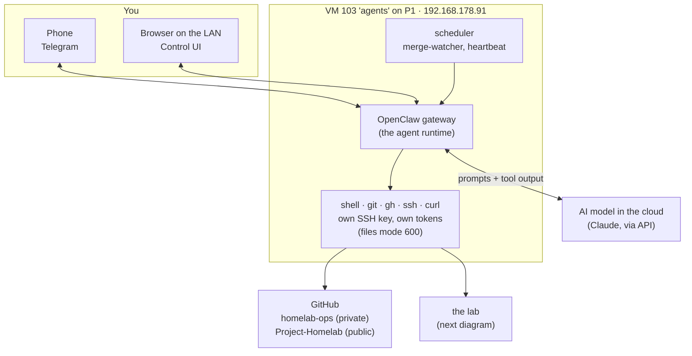
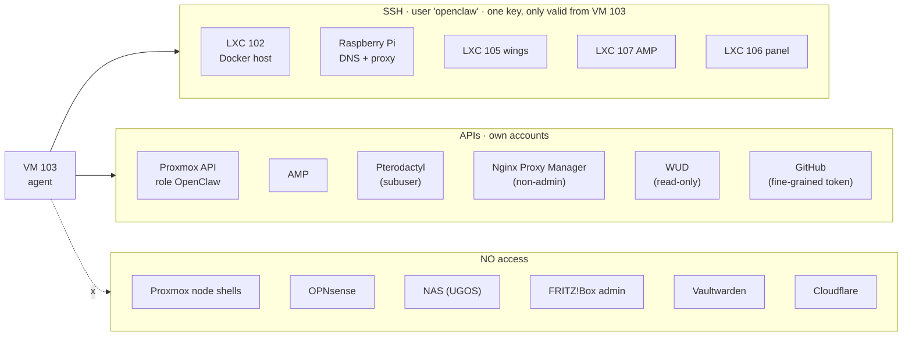
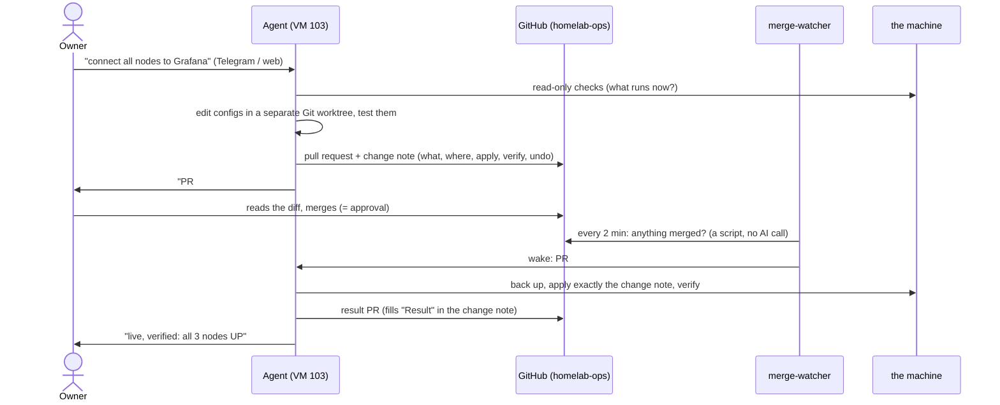

# The AI agent: DevOps with least privilege

**An AI agent does the editing work in this lab: configs, dashboards, alert
rules, documentation, checks. A human decides.** This page is the architecture:
where the agent runs, what it can reach and how, what it can *not* reach, how a
change travels from a chat message to a running machine, and what can go wrong.

How to set the same up: [runbook 27](../runbooks/27-ai-agent-with-least-privilege.md).
How it started (dated): [the October 2026 report](reports/2026-10-08-ai-agent-least-privilege.md).
What it built on its first evening: [the monitoring report](reports/2026-10-08-monitoring-security-alerting.md).

---

## Why an agent at all

A homelab run in the evenings has one bottleneck: the evening. Most changes are
small, but each one needs reading the current config, editing a file, checking it,
writing down what changed and how to undo it, and keeping the documentation
current. That is exactly the part an agent is good at, and the part that gets
skipped when a person is tired.

What it must **not** do is decide. So the design rests on two rules:

1. **The agent proposes, a human merges.** Every change is a Git pull request with
   a written plan. Nothing changes on a machine before a person has merged it.
2. **The agent gets its own narrow keys.** Its power is the sum of the
   credentials it holds, so it holds as few as possible, each one its own and
   revocable on its own.

---

## Where it runs

| | |
|---|---|
| **Machine** | VM 103 `agents` on P1: Ubuntu, 4 vCPU, ~5 GB RAM, 30 GB disk. A VM, not an LXC, so a mistake inside it cannot reach the node's kernel |
| **Runtime** | [OpenClaw](https://docs.openclaw.ai), an open-source agent gateway. It holds the conversations, runs the tools (shell, files, web), schedules jobs and talks to the chat channels |
| **Model** | Claude, called over the internet. The thinking happens in the cloud; the hands (shell, SSH, Git) are on VM 103 |
| **Channels** | Telegram (from the phone) and the web Control UI (LAN only). Both reach the same agent |
| **Reachable from** | the LAN only. Nothing on VM 103 is forwarded from the internet |

---

## What the agent can reach

Verified live on 9 October 2026. The agent has **its own identity everywhere**:
never the owner's account, never root on a Proxmox node.

| System | How | Can | Cannot |
|---|---|---|---|
| **LXC 102, the Pi** | user `openclaw`, SSH key, `sudo`, `docker` group | anything **inside that one machine**: Docker, configs | reach other machines from there with its key (the key lives only on VM 103) |
| **LXC 105 wings, 106 panel, 107 AMP** (DMZ) | same user and key, reached through OPNsense (house → DMZ is allowed, the reverse is not) | anything inside each of those containers | open a path from the DMZ into the house |
| **Proxmox cluster** | API token `openclaw@pve!agent`, custom role `OpenClaw`: `VM.Audit`, `VM.PowerMgmt`, `VM.Snapshot`, `VM.Snapshot.Rollback`, `Datastore/Sys/Pool/SDN.Audit` | see everything, start/stop guests, take and roll back snapshots | create or delete guests, change disks, network, firewall, storage, users or permissions |
| **Proxmox node shells** | **none** | | root on a node is root over every guest and disk; the API token covers what is needed |
| **AMP** | own user `openclaw`, its own role (kept broad on purpose) | instances, settings, files | the AMP host itself beyond its SSH user |
| **Pterodactyl** | non-admin user, **subuser** on the game servers; client API key limited to VM 103's address | start/stop, console, files, backups of those servers | the panel's admin area (verified: HTTP 403) |
| **Nginx Proxy Manager** | own non-admin user | manage proxy hosts and redirects, view certificates | users, settings, certificate private keys |
| **WUD** (image update checker) | read-only tokens | read | anything else |
| **GitHub** | fine-grained token on the owner's account | branches and pull requests on the owner's repositories (technically also push to `main` and merge) | change repository settings (GitHub refuses: 403). Merging and pushing to `main` it does not do, by rule; see the weak spots |
| **Monitoring logins** | copies of the read-only Proxmox exporter token, the router monitoring user, the alert bot, the game exporter key | apply and repair the monitoring | nothing beyond those (deliberately narrow, see [docs/24](24-alerting.md)) |
| **OPNsense, NAS, FRITZ!Box admin, Vaultwarden, Cloudflare** | **none** | | changes there are done by the owner, from a click-guide the agent writes |

**Where the credentials live:** one folder on VM 103, one file per system,
mode 600, readable only by the agent's user. Never in Git (a scanner blocks it),
never printed into a chat or a log. Scripts load them into the shell
environment and use them without displaying them.

**Why one SSH key:** one key is easy to audit and to revoke. Every
`authorized_keys` entry carries `from="192.168.178.91"`, so a stolen copy is
useless from anywhere but VM 103.

---

## How a change travels

The pieces:

| Piece | What it is | Why |
|---|---|---|
| **Private repo** `homelab-ops` | the real config files of every machine, at their real paths (`hosts/lxc102/opt/monitoring/prometheus.yml` = `/opt/monitoring/prometheus.yml` on LXC 102) | every change is a diff; every state can be restored |
| **Change note** `changes/YYYY-MM-DD-name.md` | in every PR: *What, Where, Apply, Verify, Undo, Result* | a merge can only be safely automated when the plan is written down. "Apply" is the exact commands |
| **Merge = apply** | merging is the approval. The agent then applies only what the note says, with a backup first | one decision point, at the place where the full diff is visible |
| **merge-watcher** | an OpenClaw automation every 2 minutes whose **condition script** asks GitHub for newly merged PRs and only wakes the agent if there is one | costs nothing while idle: no AI call unless something was merged |
| **`REPORTS.md`** | findings (R-001, R-002, ...), each with an empty *Answer* line. Committed straight to `main`, the one exception to "PRs only" | the agent **reports**, it does not fix what nobody asked it to fix |
| **Public sync** | anything worth publishing comes to this repository as a separate PR, redacted per [docs/99](99-security-notes.md) | the public docs stay current without leaking reachability |
| **Secret scanner** | [`scripts/check-secrets.sh`](../scripts/check-secrets.sh) before every commit, and in CI | discipline fails; a script does not |
| **Authorship** | every commit is authored as the owner; no agent identity, no `Co-authored-by` | the owner is accountable for what is merged; the repository history stays the owner's |

### The standing rules

Written into the agent's long-term memory, and the reason the model above works:

- **Never change anything in the lab that the owner did not explicitly ask for.**
  Findings are reported, then it waits.
- **Ask before anything dangerous or big**: deleting, restarting nodes or
  services, firewall or network changes, migrations. Read-only checks are fine.
- **Pull requests only. Never push to `main`, never merge.** (Except `REPORTS.md`.)
- **Least privilege, minimal effort for the owner**: the agent does the work, the
  owner clicks a link or pastes one command. Instructions in plain words.
- **Never put secrets into Git, chats or logs.** Use your own Git worktree, check
  the PR is still open before pushing to it, explain infrastructure simply.

---

## What it costs, and what wakes it

The model is paid per use, so the design avoids waking it for nothing:

| Wakes the agent | Does not |
|---|---|
| a message from the owner | **alerts**: Grafana sends them straight to a separate Telegram bot ([docs/24](24-alerting.md)) |
| the merge-watcher, *only* when a PR was merged | the merge-watcher's checks every 2 minutes (a script) |
| its own heartbeat, if the heartbeat checklist has something on it (empty = skipped) | monitoring, dashboards, logs: all run without it |

Work that needs no judgement (alerting, collecting metrics) never goes through
the agent. If the agent is down, the lab and its alerts carry on.

---

## What leaves the house

Everything the agent **reads** is sent to the model provider to be processed:
config files, command output, log lines, the conversation. That is the price of
a cloud model, and it shapes the habits:

- **Secrets are used, not read.** Credential files are loaded into the shell and
  passed on; their content is never printed, so it never becomes part of a
  prompt. Outputs that would contain public addresses are masked where possible
  before they are shown.
- **A secret pasted into a chat is a leaked secret.** It is in the chat history
  and went to the model provider. It happened three times while building the
  monitoring (a router password, a read-only API token, a bot token); each was
  logged as a finding with "rotate it" as the fix, and the runbooks now say how
  to hand a secret over without a chat: the owner types it into a command on the
  target machine.
- **Logs contain other people's addresses.** Website and firewall logs include
  visitors' IPs. When the agent queries them, those go to the provider too.

---

## The weak spots, honestly

| Weak spot | Why it matters | Mitigation today | Better |
|---|---|---|---|
| **VM 103 is the crown jewel** | whoever owns it owns every key above: root in five machines, power and snapshot rollback on every guest, write access to every repository | LAN-only, nothing forwarded, keys bound to its address | fewer keys on it (drop the monitoring-login copies once applied), and a backup of it |
| **`sudo` on five machines** | the agent is root inside each | each is an unprivileged container (or the Pi); Docker access is root-equivalent anyway | per-task users where Docker is not needed |
| **The GitHub token can push and merge, `main` is unprotected** | "never merge, never push to main" is a rule, not a lock | the rule, and every push is visible in the history | branch protection that requires a PR (with an exception for `REPORTS.md`), and a token limited to the two repositories |
| **Snapshot rollback** | can throw away recent changes on a guest | needs the owner's explicit OK, by rule | |
| **Prompt injection** | the agent reads text written by strangers: web pages, and now website and firewall logs (a user agent string is chosen by whoever sends the request) | OpenClaw marks external content as untrusted data, not instructions; the agent does not merge (a rule today, a lock once `main` is protected); dangerous actions need an explicit yes | keep the human merge gate, whatever else changes |
| **Mistakes, not attacks** | the realistic risk is a wrong change, not a hacked agent | written plan per change, backup before apply, read-only verification, the owner reviews every diff | |

### Things that actually went wrong

From the first two days, kept because they are the reason for several rules above:

- **A password reached the private repo** inside a copied config (a variable
  named `..._PASS`, which the scanner did not know yet). History was rewritten,
  the scanner extended, and the rule became "scrub every copied config".
- **Stacked pull requests merged into the wrong base.** A PR built on top of
  another one was merged into that branch instead of `main`, twice. Rule: build
  every PR on `main`.
- **The agent and its own merge-watcher applied the same PR at once**, twice;
  the second "backup" saved the already-changed file. Rule: check for the
  watcher's backup files before applying by hand.
- **The scanner was ignored once** because of a shell pipe (`scan | tail && commit`
  takes `tail`'s exit code). Two false positives were committed. Rule: check
  the scanner's exit code on its own.
- **It pushed to a PR that had just been merged**, so the change missed `main`.
  Rule: check the PR is still open, with the exact state, before every push.

None of these caused damage, and each was caught by the agent's own
verification step, which is the argument for having one.

---

## Removing it

Every access above is its own and can be revoked on its own, in minutes:
[runbook 27, *Undo*](../runbooks/27-ai-agent-with-least-privilege.md#undo).

---

**Back to:** [the wiki](README.md) · Related: [11 · Hardening](11-hardening.md),
[99 · Security notes](99-security-notes.md)
