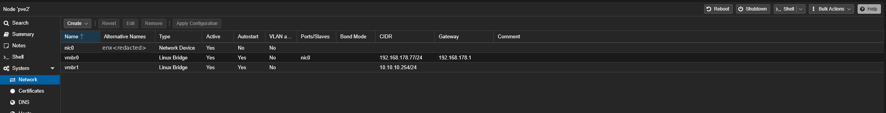

# Homelab DMZ migration

**Date** 13 August 2026
**Author** TheMindDev
**Scope** Isolating internet-facing game servers from the house LAN using a
software DMZ on Proxmox
**Outcome** Done, verified, with four known gaps documented in
[section 10](#10-security-assessment-honestly)

> **Redaction.** The public address and every externally forwarded port number
> appear as placeholders. Internal RFC1918 addressing appears in full. The rule
> is in [`docs/99-security-notes.md`](../99-security-notes.md) and it is enforced
> by [`scripts/check-secrets.sh`](../../scripts/check-secrets.sh).

---

## Contents

1. [The question I started with](#1-the-question-i-started-with)
2. [The problem in plain terms](#2-the-problem-in-plain-terms)
3. [Options considered and rejected](#3-options-considered-and-rejected)
4. [The design I chose](#4-the-design-i-chose)
5. [What changed, step by step](#5-what-changed-step-by-step)
6. [Final architecture](#6-final-architecture)
7. [Every firewall and NAT rule, and why](#7-every-firewall-and-nat-rule-and-why)
8. [Problems hit, and how they were solved](#8-problems-hit-and-how-they-were-solved)
9. [How to verify it works](#9-how-to-verify-it-works)
10. [Security assessment, honestly](#10-security-assessment-honestly)
11. [Adding a new game server from now on](#11-adding-a-new-game-server-from-now-on)
12. [Open items](#12-open-items)

The concepts learned during this work were written up separately, as
[`docs/12`](../12-network-segmentation.md) through
[`docs/20`](../20-game-server-hosting.md), and the procedures as
[runbooks 12](../../runbooks/12-create-an-isolated-bridge.md) through
[18](../../runbooks/18-reconfigure-pterodactyl-after-a-move.md). This page is
the story; those pages are the reference.

---

## 1 · The question I started with

I had game servers reachable from the internet through port forwards on the
FRITZ!Box, sitting on the same flat `192.168.178.0/24` network as everything
else I own. I had previously tried to fix this with the Proxmox firewall, twice,
and both attempts either broke connectivity or protected nothing, so the
firewall ended up disabled.

What I actually asked for was not another list of rules. It was:

- What is the standard architecture pattern for this?
- What do game self-hosters actually do?
- What can I do, what can I not do, and what is the best option for my hardware?
- And then, step by step, how?

A recurring theme through the day: I did not understand the vocabulary. NIC,
bridge, vmbr0, VLAN, DMZ, WAN, LAN, layer 2 versus layer 3. Several times I had
to stop and ask for the basics again before the instructions meant anything.

**That is the part that actually mattered**, and it is why the wiki additions
from this work start at "what is an IP address" rather than at "configure
OPNsense".

---

## 2 · The problem in plain terms

### Before

```
INTERNET
   |
FRITZ!Box .1  (forwards game ports inward)
   |
TP-Link TL-SG108 (unmanaged switch)
   |
   +-- my PC
   +-- Raspberry Pi .178      AdGuard DNS, Nginx Proxy Manager
   +-- UGREEN NAS .49         all backups
   +-- pve  .20               Proxmox web UI :8006
   +-- pve3 .50               Proxmox web UI :8006
   +-- pve2 .77               Proxmox web UI :8006
   +-- LXC 105 wings          <-- INTERNET CAN REACH THIS
   +-- LXC 107 amp            <-- AND THIS
```

Every device could talk to every other device. There was no enforcement point
anywhere.

### Why that is dangerous

**The port forward itself was never the vulnerability. The vulnerability was
that the machine the internet could reach was a peer of every machine I own.**

A Minecraft or Zomboid exploit is not exotic. Game servers run mod code, parse
untrusted input from players, and are patched slowly. Assume one gets popped. In
the old layout the attacker then had a working network path to:

- Proxmox on `:8006` with no 2FA and `root@pam` in use
- the NAS holding all my backups
- Vaultwarden, my password vault
- AdGuard, which controls DNS for the whole house
- my own PC

**One game exploit equalled total compromise.**

### Why my previous firewall attempts failed

I was trying to enforce separation with **rules** on a **flat** network. Every
machine still had a physical path to every other one. One wrong rule either
broke everything or protected nothing, and debugging it meant reading
`cluster.fw` and per-guest `.fw` files with no visibility into what was being
dropped.

That approach is brittle by design. **This is the single most useful thing I
learned all day**, and it is written up as
[`docs/12`](../12-network-segmentation.md).

---

## 3 · Options considered and rejected

| Option | Verdict | Reason |
|---|---|---|
| Do nothing, keep flat port forwards | rejected | this was the existing state and the whole problem |
| Rented VPS plus WireGuard relay, about 4 EUR a month | **rejected by me** | I paid for my homelab to host my own things; I am not renting someone else's box |
| Free third-party relay (playit.gg, ngrok) | rejected | a stranger's machine sits in the middle of my traffic, plus added latency |
| Buy a router and put it in line | rejected | I tried exactly this before with a FriendlyElec router. A second router **in line** behind the FRITZ!Box creates double NAT, two DHCP servers, two layers of port forwarding, and split networks. It was a mess. |
| Managed switch and VLANs alone | rejected for now | a VLAN separates but cannot route or filter. Also my TL-SG108 is unmanaged and cannot tag frames at all. |
| Full rebuild: replace the FRITZ!Box, dedicated modem, OPNsense box, managed switch | deferred | roughly 180 EUR, a weekend, and whole-LAN downtime. Worth doing later. The FRITZ!Box 7590 has no usable bridge mode on DSL, so it cannot be demoted to a modem; it would have to be replaced. |
| **Software DMZ on the hypervisor** | **chosen** | zero cost, zero LAN downtime, uses hardware I already own, and the rules transfer unchanged to a hardware VLAN later |

### The key realisation about the FriendlyElec failure

My earlier disaster was not caused by the software or the device. It was caused
by **position in the cable path**.

```
IN LINE  (what I did before, bad)
internet -> FRITZ!Box [NAT 1] -> FriendlyElec [NAT 2] -> switch -> EVERYTHING

ON A STICK  (what we built, good)
internet -> FRITZ!Box [NAT 1] -> switch -> everything, unchanged
                                    |
                              OPNsense [NAT 2, game segment only]
                                    |
                              sealed containers
```

OPNsense is **not** in the path. Nothing has to travel through it to reach the
internet. My PC, Pi, NAS and all three Proxmox nodes still route exactly as
before. Only the game containers sit behind the second NAT.

This is called **router on a stick**, or one-armed routing.

---

## 4 · The design I chose

**The pattern, in one sentence:** anything the internet can talk to lives in its
own network that has no path into the real network.

Two halves, and both are required:

1. **Separation.** The exposed machine is in a different network segment with no
   physical path. Not "is blocked from", but has no road at all.
2. **A chokepoint.** One router/firewall sits between that segment and the LAN,
   and it is the only door. All rules live there.

VLANs are one way to do the separation. They are not the idea itself. Nobody had
explained that to me before.

**Implementation:** a Proxmox bridge with `bridge-ports none` (a switch made of
software, with no cable) plus an OPNsense VM with one leg on each side.

Why this is structurally stronger than rules on a flat network: a rule can be
deleted by mistake and the path is live again. **A missing cable cannot be
deleted by mistake.** Deleting the block rule in the current design changes
reachability not at all, because the road does not exist.

---

## 5 · What changed, step by step

### Phase 0 · Discovery

```bash
pct list
pvesm status
pct config 105
pct config 107
```

Findings: 105 had 12 GB allocated, 107 had 8 GB, and pve2 had only 15.5 GB
total at the time. Both would not fit alongside a 2 GB OPNsense VM.

Also discovered that `pve2` is `192.168.178.77`, not `.50` as the repository
claimed; `.50` is pve3. The NPM hostnames p1/p2/p3 map correctly to
`.20`/`.77`/`.50`, but the repo inventory had them swapped. **Fixed as part of
this work.**

Backups to the NAS were skipped because the NAS currently has no drives
installed. That is a real gap, not a decision.

### Phase 1 · Trim RAM

```bash
pct set 105 --memory 6144
pct set 107 --memory 6144
```

### Phase 2 · Migrate to pve2

```bash
pct migrate 105 pve2 --restart --target-storage local-lvm   # 8m 12s
pct migrate 107 pve2 --restart --target-storage local-lvm   # 8m 48s
```

Offline migration, so this was the main downtime. `--target-storage local-lvm`
because 105's disk lived on storage named `pve` and 107's on `local-lvm`; both
exist on pve2 but standardising avoided a failure.

Confirmed guest disks land on NVMe:

```bash
lsblk -o NAME,SIZE,ROTA,MOUNTPOINT   # ROTA 0 = SSD/NVMe
pvs                                  # pve VG on /dev/nvme0n1p3
```

### Phase 3 · Create the sealed bridge

```bash
cp /etc/network/interfaces /etc/network/interfaces.bak
cat >> /etc/network/interfaces << 'STANZA'
auto vmbr1
iface vmbr1 inet static
    address 10.10.10.254/24
    bridge-ports none
    bridge-stp off
    bridge-fd 0
STANZA
ifreload -a
ip -br a show vmbr1
```



*The empty Ports/Slaves cell on `vmbr1` is the isolation. Note that
`10.10.10.254/24` is still on it, which is an outstanding item.*

**`bridge-ports none` is the single line that creates the isolation.** The
`.254` address was temporary, for testing before OPNsense existed; OPNsense
later took `.1`.

The bridge shows state `UNKNOWN` until something attaches to it. That is normal.

→ [Runbook 12](../../runbooks/12-create-an-isolated-bridge.md)

### Phase 4 · The OPNsense VM

```bash
cd /var/lib/vz/template/iso
wget https://mirror.uvensys.de/opnsense/releases/mirror/OPNsense-26.7-dvd-amd64.iso.bz2
bunzip2 OPNsense-26.7-dvd-amd64.iso.bz2
```

`bunzip2` matters: the download is compressed and Proxmox cannot boot a `.bz2`.

```bash
qm create 200 \
  --name opnsense --memory 2048 --cores 2 --ostype other \
  --scsihw virtio-scsi-single --scsi0 local-lvm:20 \
  --net0 virtio,bridge=vmbr0 \
  --net1 virtio,bridge=vmbr1 \
  --ide2 local:iso/OPNsense-26.7-dvd-amd64.iso,media=cdrom \
  --boot order=ide2\;scsi0 --onboot 1
qm start 200
```

Two NICs, because a door needs two sides.

**Chose OPNsense over pfSense** because it ships weekly updates, has a cleaner
GUI, and is what most homelabs run today. pfSense CE has slowed down and its
licensing has been unpredictable.

**Chose UFS over ZFS** because ZFS wants more RAM for caching and gains nothing
on a 20 GB virtual disk sitting on LVM-thin.

→ [Runbook 13](../../runbooks/13-install-the-opnsense-vm.md)

### Phase 5 · Interface assignment and addressing

Console option 1: LAGGs no, VLANs no, WAN `vtnet0`, LAN `vtnet1`.

Console option 2:

| Leg | Address | Gateway | DHCP server |
|---|---|---|---|
| WAN (`vtnet0`) | `192.168.178.60/24` | `192.168.178.1` | **off** |
| LAN (`vtnet1`) | `10.10.10.1/24` | none | **off** |

**DHCP off on both legs is critical.** A second DHCP server on the house LAN is
exactly what wrecked the FriendlyElec setup.

Then remove the temporary host address so it does not collide:

```bash
sed -i '/10.10.10.254/d' /etc/network/interfaces
ifreload -a
```

Verified Dnsmasq, which serves DNS and DHCP in 26.7 (ISC DHCPv4 was removed in
recent releases), was disabled entirely.

### Phase 6 · The block rule

Firewall → Rules → LAN, placed **above** the two default allow rules:

- Action **Block**, Interface LAN, Direction In, IPv4, Protocol any
- Source **LAN net**, Destination `192.168.178.0/24`
- Quick ticked

→ [Runbook 14](../../runbooks/14-opnsense-dmz-firewall-rules.md)

### Phase 7 · Move the containers

```bash
pct set 105 --net0 name=eth0,bridge=vmbr1,ip=10.10.10.20/24,gw=10.10.10.1
pct set 107 --net0 name=eth0,bridge=vmbr1,ip=10.10.10.21/24,gw=10.10.10.1
pct set 105 --nameserver 1.1.1.1
pct set 107 --nameserver 1.1.1.1
pct reboot 105
pct reboot 107
```

`gw=10.10.10.1` tells each container "when you want anything outside your
network, hand it to OPNsense".

**DNS had to change to `1.1.1.1`** because AdGuard sits at `192.168.178.178`,
inside the range the block rule refuses. The containers could reach the internet
but could not resolve any name. Cost: those containers lose ad blocking, which
is irrelevant for game servers. A cleaner future option is enabling Dnsmasq on
the OPNsense LAN leg and pointing containers at `10.10.10.1`.

→ [Runbook 15](../../runbooks/15-move-an-lxc-into-the-dmz.md)

### Phase 8 · First verification

The three commands, as typed:

```bash
pct exec 105 -- timeout 4 curl -sk https://192.168.178.77:8006      # Proxmox API
pct exec 105 -- timeout 4 curl -sk https://192.168.178.49           # the NAS
pct exec 105 -- timeout 4 curl -sk https://192.168.178.178          # AdGuard DNS
```

```
wings -> 1.1.1.1               works
wings -> pve2:8006             exit 124 (timeout)
wings -> NAS .49               exit 124
wings -> AdGuard .178          exit 124
amp   -> 1.1.1.1               works
amp   -> pve2:8006             exit 124
```

**This was the moment the project succeeded.** Everything after was plumbing.

### Phase 9 · Move the panel in too

Originally the plan was an allow rule letting wings reach the panel at
`192.168.178.84`. I asked whether that reopened the hole. The better answer,
which I chose, was to move the panel into the sealed segment as well, so no
game-hosting service has any route into the house at all.

```bash
pct migrate 106 pve2 --restart --target-storage local-lvm   # 52s
pct set 106 --net0 name=eth0,bridge=vmbr1,ip=10.10.10.22/24,gw=10.10.10.1
pct set 106 --nameserver 1.1.1.1
pct reboot 106
```

The panel container runs Apache, MariaDB and Redis, with MariaDB and Redis bound
to `127.0.0.1` only, so nothing external depended on them and the move was
clean.

Then wings was pointed at the panel's internal address:

```bash
pct exec 105 -- sed -i "s|^remote:.*|remote: 'http://10.10.10.22'|" /etc/pterodactyl/config.yml
pct exec 105 -- systemctl restart wings
```

Result: `panel=200` from wings, `sealed=124` from panel to Proxmox. Both talking
to each other, neither able to reach the house.

### Phase 10 · Reachability for me

Three mechanisms, in the order they were tried:

1. **Port forwards with NAT reflection.** Needed because my PC sits in the same
   subnet as the OPNsense WAN leg, so traffic does not arrive the way an
   internet packet would and `pf` did not apply the redirect. Enabled globally
   at Firewall → Settings → Advanced: *Reflection for destination NAT* and
   *Automatic outbound NAT for Reflection*.
2. **A static route on the FRITZ!Box** (Heimnetz → Netzwerk →
   Netzwerkeinstellungen → Erweiterte Netzwerkeinstellungen → Statische Routen):
   `10.10.10.0/24` via `192.168.178.60`. This is the cleaner mechanism and is
   what actually made things work reliably.
3. **A floating pass rule** from `192.168.178.0/24` to `10.10.10.0/24`, because
   a route grants no permission.

### Phase 11 · Pterodactyl reconfiguration

Four separate places store addresses, and all four were wrong at once after the
move:

| Setting | Purpose | Value |
|---|---|---|
| Panel `APP_URL` | what the panel generates links and wings configs from | `http://10.10.10.22` |
| wings `remote:` | wings to panel, internal | `http://10.10.10.22` |
| node `fqdn` | **browser to wings**, for the console websocket | `10.10.10.20` |
| allocations | the address a game server binds to | `10.10.10.20:<port>` |

The panel lives at `/opt/pterodactyl-panel` with `/var/www/pterodactyl`
symlinked to it. That mattered: early `sed` commands against
`/var/www/pterodactyl/.env` silently did nothing useful.

Allocations had to be fixed in the database because the admin UI's allocation
dropdown kept returning "No results found":

```bash
# backup first
pct exec 106 -- bash -c 'source /opt/pterodactyl-panel/.env; \
  mysqldump -u$DB_USERNAME -p$DB_PASSWORD $DB_DATABASE > /root/panel-backup-$(date +%F).sql'
```

**IDs below are this lab's.** They are a record of what was run here, not a
recipe. See
[runbook 18](../../runbooks/18-reconfigure-pterodactyl-after-a-move.md) for how
to find your own first.

```sql
UPDATE allocations SET server_id = 1 WHERE id IN (1001, 1002);
UPDATE allocations SET server_id = 3 WHERE id = 1003;
UPDATE servers SET allocation_id = 1001 WHERE id = 1;
UPDATE servers SET allocation_id = 1003 WHERE id = 3;
UPDATE allocations SET server_id = NULL WHERE id IN (1, 2, 3);
UPDATE nodes SET fqdn = "10.10.10.20" WHERE id = 1;
```

**I considered creating a new node and rejected it.** In Pterodactyl a server
belongs permanently to a node; there is no move button. A new node means
recreating each server with a new UUID and manually copying volume directories,
and databases, schedules, users and subusers do not come along. Editing
allocations in place was strictly safer.

→ [Runbook 18](../../runbooks/18-reconfigure-pterodactyl-after-a-move.md)

### Phase 12 · Publishing the games

OPNsense destination NAT (called **Destination NAT** in 26.7, formerly Port
Forward), plus matching FRITZ!Box shares, all attached to the single OPNsense
device entry at `192.168.178.60`.

→ [Runbook 16](../../runbooks/16-publish-a-game-server-port.md)

### Phase 13 · AMP

AMP needed **no internal reconfiguration at all**, because every service binds
to `0.0.0.0` and therefore listens on whatever address the container has. Only
NAT rules and FRITZ!Box shares were needed. Its licence, however, had to be
reactivated (see [section 8](#8-problems-hit-and-how-they-were-solved)).

---

## 6 · Final architecture

```
                        INTERNET
                            |
                     <public address>
                            |
                  +-------------------+
                  |  FRITZ!Box .1     |  game port forwards -> .60
                  |  static route:    |  10.10.10.0/24 via .60
                  +---------+---------+
                            |
                   TP-Link TL-SG108 (unmanaged)
                            |
      +--------+------------+----------+----------+---------+
      |        |            |          |          |         |
   my PC   Pi .178      NAS .49    pve .20   pve3 .50   pve2 .77
           AdGuard                                          |
           NPM                                           vmbr0
                                                            |
                                        +-------------------+-------------------+
                                        |        OPNsense VM 200                |
                                        |  WAN  vtnet0 -> vmbr0  192.168.178.60 |
                                        |  LAN  vtnet1 -> vmbr1  10.10.10.1     |
                                        +-------------------+-------------------+
                                                            |
                                            vmbr1  (bridge-ports none, NO CABLE)
                                                            |
                        +-----------------+-----------------+-----------------+
                        |                 |                                   |
                 wings 10.10.10.20   amp 10.10.10.21                panel 10.10.10.22
                 zomboid, minecraft  terraria, space engineers      Apache :80
                 wings api :9090     amp web :8080                  MariaDB, Redis
                 sftp :2022          amp sftp :2223                 (localhost only)
```

### House network, `192.168.178.0/24`

| Device | Address | Notes |
|---|---|---|
| FRITZ!Box 7590 | .1 | gateway, DHCP, port forwards, static route |
| pve (P1) | .20 | Proxmox :8006 |
| UGREEN NAS | .49 | no drives currently installed |
| pve3 (P3) | .50 | Proxmox :8006 |
| **OPNsense WAN** | **.60** | web GUI on :80, LAN-restricted |
| pve2 (P2) | .77 | Proxmox :8006 |
| Raspberry Pi 5 | .178 | AdGuard DNS, NPM, Tailscale |

### Sealed segment, `10.10.10.0/24`

| Device | Address | Ports |
|---|---|---|
| OPNsense LAN | 10.10.10.1 | the only exit |
| LXC 105 wings | 10.10.10.20 | game ports, 9090 api, 2022 sftp |
| LXC 107 amp | 10.10.10.21 | game ports, 8080 web, 2223 sftp |
| LXC 106 panel | 10.10.10.22 | 80 |


### Guests by node

- **pve (.20)** · 101 casaos, 102 docker (Vaultwarden, Grafana, Prometheus, n8n,
  Portainer, cloudflared)
- **pve2 (.77)** · 100 jellyfin *(still on vmbr0, house side)*, 105 wings,
  106 panel, 107 amp *(all sealed)*, 200 opnsense
- **pve3 (.50)** · unchanged

pve2 hardware: ThinkCentre M710q, i5-7400T, 238 GB NVMe (69 GB root plus 141 GB
LVM-thin pool) plus a separate 1 TB HDD at `/mnt/pve/hdd-1tb`. It had 15.5 GB of
RAM during the migration, which is why 105 and 107 had to be trimmed; it has
since been raised to 32 GB.

---

## 7 · Every firewall and NAT rule, and why


*Every rule described below, in one screen.*

### LAN rules, traffic leaving the sealed segment

"LAN" is the sealed side. "In" means arriving at OPNsense from the containers.

| # | Action | From | To | Purpose |
|---|---|---|---|---|
| 1 | **BLOCK** | LAN net | `192.168.178.0/24` | the entire point of the project |
| 2 | PASS | LAN net | any | internet, Steam, updates |
| 3 | PASS (IPv6) | LAN net | any | leftover default, **should be deleted** |

**Order is everything.** `pf` reads top to bottom and stops at the first match
because Quick is ticked. A packet aimed at the NAS hits rule 1 and dies. A
packet aimed at Steam misses rule 1, hits rule 2, and goes.

When the block rule was initially saved at the *bottom* of the list, rule 2
caught everything first and the block never ran at all.

### Floating rule, traffic entering the sealed segment

| Action | From | To |
|---|---|---|
| PASS | `192.168.178.0/24` | `10.10.10.0/24` |

**This is the rule I was most suspicious of, and it does not undo the block.**
It permits the opposite direction. My PC to the panel: allowed, source is
`192.168.178.x`. A compromised game server to my NAS: still blocked, source is
`10.10.10.x` and it hits rule 1.

Because `pf` is stateful, replies to conversations I start flow back without
their own rule. The attacker cannot exploit this because they cannot start a
conversation.

**A one-way door. I walk in; they cannot walk out.**

*Minor tidiness note:* this landed under Floating rules rather than on the WAN
interface. It works; floating rules apply across all interfaces, which is
broader than strictly needed.

### WAN rules, from the house to OPNsense itself

| Port | Source | Purpose |
|---|---|---|
| 80/tcp | `192.168.178.0/24` | the OPNsense web GUI |

Restricted to the house, and the FRITZ!Box forwards nothing to it, so it is
invisible from the internet.

### Destination NAT rules

**Admin, house-restricted:**

| External | Source | Target |
|---|---|---|
| .60:8080/tcp | `192.168.178.0/24` | `10.10.10.22:80` (panel) |
| .60:9090/tcp | `192.168.178.0/24` | `10.10.10.20:9090` (wings API) |

**Games, world-open:** four rules, source `any`, targeting `10.10.10.20`
(Pterodactyl games) and `10.10.10.21` (AMP games). External port numbers are
deliberately not published here.

Source `any` on game ports is unavoidable: players come from the internet.
Source is restricted on the admin ports because only I use them.

### FRITZ!Box shares

All attached to a single device entry, **OPNsense at `192.168.178.60`**. Four
shares, matching the four game rules above.

**Exposed Host remains unticked** for both IPv4 and IPv6. That checkbox sounds
like a DMZ and is the opposite: it forwards every unsolicited port to one
machine sitting on the normal LAN.

### The static route, what it does and does not do

`10.10.10.0/24` via `192.168.178.60`, configured on the FRITZ!Box.

**A route is not a permission. A route is a signpost.** It says "if you want
`10.10.10.x`, go via `.60`". It grants nothing. Without the floating pass rule,
packets would arrive at OPNsense and be dropped.

Two independent systems:

- **Routing** answers *which way do I go?*
- **Firewalling** answers *am I allowed?*

Why it was needed: my PC had no idea `10.10.10.x` existed. It would have handed
those packets to the FRITZ!Box, which would have thrown them at the internet,
where they die.

Why it weakens nothing: the internet cannot use it, because it exists only
inside my house and nothing outside knows it. And it points at a firewall, not
at the containers. Every packet still faces the rules.

### NAT reflection, what it is

My PC and the OPNsense WAN leg are on the same subnet. A packet from my PC to
`.60:8080` does not "arrive from outside" the way an internet packet would, so
`pf` did not apply the port forward and the connection timed out. Reflection
makes the firewall handle same-subnet traffic like external traffic.

It is a convenience feature for this topology, not a security setting.

---

## 8 · Problems hit, and how they were solved

### Proxmox console: "Failed to connect to server"

**Cause.** The Proxmox web UI is cluster-wide, so from pve I can *see* guests on
pve2. But the console websocket connects **directly to the node hosting the
guest**, on its own port 8006 with its own self-signed certificate. My browser
did not trust pve2's certificate, so the socket died silently while the rest of
the UI kept working.

**Fix.** Open the console from the hostname of the node actually running the
guest (`p2.theminddev.com`), or visit `https://192.168.178.77:8006` once and
accept the certificate.

**Lesson.** Open the console from the node that hosts the guest.

### Booted the installer CD instead of the installed disk, twice

**Cause.** SeaBIOS tried `scsi0`, did not immediately find a bootloader, and
fell back to the CD. Setting `--boot order=scsi0` was not enough.

**Fix.** `qm set 200 --ide2 none,media=cdrom` to detach the ISO entirely.

**How to tell.** A live-mode boot shows
`Root file system: /dev/iso9660/OPNSENSE_INSTALL`. A real boot shows
`/dev/gpt/rootfs`. Anything configured in live mode is lost on reboot, which is
why interface assignment had to be done twice.

### Config importer appeared during boot

**Cause.** A key was pressed during boot, triggering the tool that restores a
saved config from USB.

**Fix.** Press Enter on an empty line to exit.

### OPNsense web GUI unreachable at .60

Two causes stacked.

1. **"Block private networks" and "Block bogon networks" were ticked on WAN.**
   These exist for a firewall facing the real internet, where private source
   addresses arriving from outside are spoofed. Mine faces my house, which *is*
   a private network, so it dropped everything. Both must be unticked in this
   topology.
2. **The address had not been applied to the interface.** `/conf/config.xml`
   correctly said `192.168.178.60`, but `ifconfig vtnet0` still showed the old
   DHCP lease. `configctl interface reconfigure wan` returned OK and changed
   nothing.

**Fix.** Reboot the VM. A clean boot applies the saved config correctly.

**Lesson.** Config file and running state can disagree. Check both.

### "This IP address conflicts with another interface"

**Cause.** `.60` had been assigned to the wrong leg first. One address cannot
exist on two interfaces.

**Fix.** Move the wrong one away first, then assign.

### GUI locked out after applying rules

**Cause.** OPNsense blocks the web GUI on WAN by default, and my PC is on the
WAN side. Earlier access only worked because `pfctl -d` had disabled filtering;
applying rules re-enabled it.

**Fix.** `pfctl -d` from console option 8 to get back in, create the WAN pass
rule for port 80 from `192.168.178.0/24`, then `pfctl -e`.

**What `pfctl` is.** The command that controls `pf`, the FreeBSD packet filter.
`pf` is the actual firewall engine; the GUI just writes rules for it. `-d`
disables, `-e` enables, `-s rules` lists.

→ [Runbook 17](../../runbooks/17-recover-from-an-opnsense-lockout.md)

### "Cannot move a rule before itself"

**Cause.** The arrow icon means "insert the selected rules **here**", not "move
this rule up". I had ticked the rule and clicked the arrow on its own row.

**Fix.** Tick the rule to move, then click the arrow on the row you want it
placed above.

### Panel 500 Server Error

**Cause.** Running `artisan` as root created cache files owned by root under
`/opt/pterodactyl-panel/storage/framework/cache/`, which Apache (running as
`www-data`) then could not write to.

```
file_put_contents(...): Failed to open stream: Permission denied
```

**Fix.**

```bash
pct exec 106 -- chown -R www-data:www-data \
  /opt/pterodactyl-panel/storage /opt/pterodactyl-panel/bootstrap/cache
pct exec 106 -- systemctl restart apache2
```

**Prevention.** Always `sudo -u www-data php /opt/pterodactyl-panel/artisan ...`

### wings could not reach the panel

**Cause.** `wings configure` fetches its config **from the panel**, which
generates `remote:` from its own `APP_URL`. While `APP_URL` was the old address,
every reconfigure handed wings an address the block rule refuses.

**Fix.** Set `APP_URL=http://10.10.10.22` at `/opt/pterodactyl-panel/.env` (note
`/opt/...`, not `/var/www/...`), then fix wings' own copy.

**Lesson.** Fix the source of a generated value, not just the generated copy.

### Allocation dropdown: "No results found"

**Cause.** Not fully determined. The allocations existed in the database and the
node was correct. Likely a caching or UI issue compounded by the panel's 500
errors.

**Fix.** Direct database updates, after a `mysqldump` backup.

### Console spinner: "We're having some trouble connecting to your server"

**Cause.** The live console does not go browser → panel → wings. The browser
opens a **websocket directly to wings**, stamped with an `Origin` header naming
the page it came from. wings checks that against its trusted list, found
`allowed_origins: []`, fell back to trusting only the panel URL it knew, and
answered `403`.

```
websocket: request origin not allowed by Upgrader.CheckOrigin   status=403
```

The Go stack trace in the log looked like a crash but was just the recovery
middleware logging a rejected request.

**Fix.** Replace the key in `/etc/pterodactyl/config.yml`:

```yaml
allowed_origins: ["http://192.168.178.60:8080", "http://10.10.10.22"]
```

then `systemctl restart wings`.

**Two traps.** The key already existed as an empty list, so adding a second one
created a YAML duplicate that resolved unpredictably; it had to be *replaced*.
And flow style with square brackets avoids the indentation problem entirely.

**Standing rule:** if the address used to reach the panel ever changes, add it
to `allowed_origins` or consoles will 403 again.

### AMP: NO_LICENCE / NoMatchingMachineId

```
[Licencing Error/6] : Unable to load licence for AMP Professional Edition - NoMatchingMachineId
[Core Warning/10]   : Expected licence feature RunAMP is not present.
```

**Cause.** AMP licences activate against a **machine fingerprint**. Moving LXC
107 to a different physical host changed it.

Ruled out first: DNS resolved, HTTPS to the licence server returned 200, both
instances were stopped so no concurrency limit applied.

**Fix.**

```bash
pct exec 107 -- su - amp -c "ampinstmgr reactivate <InstanceName>"
```

**Recurrence.** Only if 107 moves hosts again. Newly created instances inherit
the licence and are unaffected.

### Zomboid OOM, exit code 137

**Cause.** LXC 105 was trimmed to 6 GB, but the Pterodactyl panel still
allocated 12 GiB to that server. The container's cap and the panel's per-server
limit disagreed, so the game was killed.

**Lesson.** Container memory and the panel's per-server memory limit must agree.

### Command-context mistakes

- `ssh pve2 "..."` run **from inside** container 105 fails; there is no `pve2`
  name there.
- `sed .../etc/pterodactyl/config.yml` run **on pve2 itself** fails; Proxmox
  hosts have no such file. Use `pct exec 105 -- ...`.
- `ifconfig` is FreeBSD; `ipconfig` is Windows. Typing the wrong one wastes time.
- FreeBSD tools (`pfctl`, `sockstat`) do not exist on the Debian-based Proxmox
  host.

**Before typing a command, know which of the three machines you are on:** the
Proxmox host, the OPNsense VM, or a container.

---

## 9 · How to verify it works

### Test 1 · The wall holds

```bash
for target in 192.168.178.77:8006 192.168.178.20:8006 192.168.178.49 192.168.178.178 192.168.178.1; do
  echo -n "$target -> "
  pct exec 105 -- timeout 4 curl -sk -o /dev/null "https://$target" 2>/dev/null \
    && echo REACHABLE || echo blocked
done
```

Expected: every line `blocked`. **Exit code 124 means timeout, which is the
desired outcome.**

The same three targets, as single commands:

```bash
pct exec 105 -- timeout 4 curl -sk https://192.168.178.77:8006      # Proxmox API
pct exec 105 -- timeout 4 curl -sk https://192.168.178.49           # the NAS
pct exec 105 -- timeout 4 curl -sk https://192.168.178.178          # AdGuard DNS
```

Chosen deliberately: the hypervisor that controls every guest, the box holding
every backup, and the resolver for the whole house.

### Test 2 · Scan the house from inside the segment

The convincing one.

```bash
pct exec 105 -- bash -c 'apt-get update -qq && apt-get install -y -qq nmap'
pct exec 105 -- nmap -sn --host-timeout 5s 192.168.178.0/24
```

Before this migration, that would have listed every device in the house. Now it
should find nothing. Remove `nmap` afterwards if you prefer a clean container.

### Test 3 · The internet still works

```bash
pct exec 105 -- timeout 5 curl -s -o /dev/null -w 'steam=%{http_code}\n' https://store.steampowered.com
```

### Test 4 · Watch it live

Firewall → Log Files → Live View, filter on `10.10.10`. Run test 1 and watch
blocked entries appear in real time with the rule that caught them.


**This visibility is the thing the Proxmox firewall never gave, and the reason
two earlier attempts failed.**

### Test 5 · What the world sees

From a phone on mobile data, use an external port scanner against the public
address. Expected: game ports open, everything else closed. Specifically
**8006, 8080, 9090 and 80 must all be closed**.

### Test 6 · Services still function

```bash
pct exec 105 -- timeout 5 curl -s -o /dev/null -w 'panel=%{http_code}\n' http://10.10.10.22
pct exec 107 -- ss -tulnp
```

---

## 10 · Security assessment, honestly

### What genuinely improved

**Before:** the machine the internet could reach was a peer of every machine I
own. One compromise, total access: Proxmox with no 2FA, the NAS with all
backups, Vaultwarden with all passwords.

**After:** a compromised game server reaches the internet and nothing else in
the house. Verified repeatedly with real timeouts, not theory.

That is the single largest improvement available, and it cost nothing.

### What is still weak, in order of seriousness

**1 · The sealed segment has no internal walls.**
wings, AMP and the panel all share `10.10.10.0/24`. Traffic between them never
touches OPNsense, because they are neighbours on the same bridge. Compromise a
Minecraft server and you can reach the panel; panel admin means code execution
on wings. Fixing this means separate subnets per service.

**2 · Outbound is unrestricted.**
Rule 2 permits the segment to reach *anything* on the internet. A compromised
server could mine crypto, join a botnet, or attack others from my address.
Proper practice is restricting egress to what is actually needed.

**3 · A Proxmox host escape defeats everything.**
OPNsense is a VM on pve2, and both bridges live on pve2. Root there controls the
referee. This is the gap a hardware VLAN closes, because enforcement then lives
in a box the compromised machine does not control.

**4 · The leftover IPv6 allow rule.**
The block rule is IPv4 only, and a default "allow LAN IPv6 to any" remains.
Harmless today because the segment has no IPv6, but if it ever gets an address,
that rule is an open door around the block. **Should be deleted.**

**5 · Games are still exposed, inherently.**
A Minecraft exploit still gets someone into that container. The point was never
to prevent that; it was to make it not matter.

**6 · Carried over from before this work:** no Proxmox 2FA, `root@pam` in use,
NPM hostnames marked "Publicly Accessible", and an application API token that
was exposed and needs rotating.

### A fair grade

Went from **"one game exploit costs everything"** to **"one game exploit costs
the game containers"**.

Not yet at **"one game exploit costs one container"**. Getting there needs
per-service segments and egress rules.

---

## 11 · Adding a new game server from now on

The migration was a one-time cost. Ongoing work is three steps, roughly two
minutes.

1. **Panel:** create the server and pick a free allocation. Ports on
   `10.10.10.20` are pre-created for this.
2. **OPNsense:** one Destination NAT rule. Use the **copy icon** on an existing
   rule and change only the ports and target; that reduces it to three fields.
3. **FRITZ!Box:** one share on the OPNsense device entry.

Before this work it was steps 1 and 3. **So the ongoing cost of the whole DMZ is
one extra click per game.**

### Making it even cheaper later

Firewall → Aliases: define `wings = 10.10.10.20` and `amp = 10.10.10.21` once,
then reference them by name in rules. If a container ever moves, change the
alias once and every rule follows. A **Port** alias can also cover several ports
in a single rule where protocol and internal/external ports match.

The FRITZ!Box side has no cloning and stays manual while it remains the edge
router.

→ [Runbook 16](../../runbooks/16-publish-a-game-server-port.md)

---

## 12 · Open items

### Security backlog

- [ ] Proxmox TOTP 2FA and a non-root admin user
- [ ] Restrict NPM access lists for p1/p2/p3 to `192.168.178.0/24`
- [ ] Restrict outbound traffic from the sealed segment
- [ ] Split the sealed segment per service
- [ ] Enable Dnsmasq on the OPNsense LAN leg, so DMZ guests stop talking to a
      public resolver directly


### Hardware, later

- [x] Move RAM to pve2, which now carries the whole game stack plus OPNsense
- [ ] Rack the Omada ES210X-M2 (8x 2.5G, 2x 10G SFP+, 802.1Q, "Easy Managed"
      tier: no ACLs, no L3). 209 x 126 x 26 mm, fits a 10-inch rack on a shelf;
      no rack ears included.
- [ ] Swap vmbr1 for a real tagged VLAN on that switch. **The OPNsense rules
      stay byte-for-byte identical.** That is the payoff of building the
      software version first.
- [ ] Monitor the LVM-thin pool: alert on `pve-data` above 80% and root above
      85%

---

**See also:** [`docs/12` · network segmentation](../12-network-segmentation.md) ·
[the wiki](../) · [the runbooks](../../runbooks/) ·
[repository root](../../README.md)
