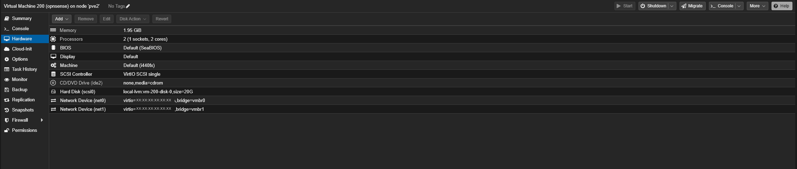
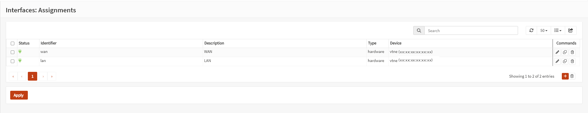
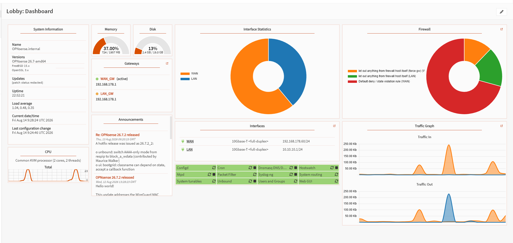

# Runbook 13 · Install the OPNsense VM

**Goal** VM 200 on pve2 running OPNsense, with one leg on the house LAN
(`192.168.178.60`) and one on the sealed bridge (`10.10.10.1`), GUI reachable
from the house.

**Time** 45 minutes, most of it the installer and two reboots.
**Prerequisites** [Runbook 12](12-create-an-isolated-bridge.md) done, so `vmbr1`
exists. A free address on the house LAN. Console access to the Proxmox node that
will host it.
**Reverses cleanly?** Yes. `qm stop 200 && qm destroy 200`. Nothing else changes.

Why a VM and not a container, and why OPNsense over pfSense, are in
[`docs/17-opnsense-concepts.md`](../docs/17-opnsense-concepts.md).

---

## 0 · Decide, before you type anything

| Decision | This lab | Why |
|---|---|---|
| VMID | `200` | outside the container range, so the firewall stands out in `pct list` / `qm list` |
| WAN address | `192.168.178.60` | free, static, outside the DHCP pool |
| LAN address | `10.10.10.1` | the gateway every DMZ guest will point at |
| RAM | 2048 MB | routing and `pf` are cheap |
| Cores | 2 | not reserved; see [`docs/19`](../docs/19-lxc-migration-and-resources.md) |
| Disk | 20 GB | base install is a few GB, the rest is logs |
| Filesystem | **UFS** | ZFS wants RAM and gains nothing on a thin-provisioned virtual disk |

**Check the WAN address is genuinely free:**

```bash
ping -c2 192.168.178.60          # want "Destination Host Unreachable"
arping -c3 -I vmbr0 192.168.178.60
```

---

## 1 · Fetch the ISO

```bash
cd /var/lib/vz/template/iso
wget https://mirror.uvensys.de/opnsense/releases/mirror/OPNsense-26.7-dvd-amd64.iso.bz2
bunzip2 OPNsense-26.7-dvd-amd64.iso.bz2
ls -lh OPNsense-26.7-dvd-amd64.iso
```

**`bunzip2` is a required step, not a nicety.** The download is compressed and
Proxmox cannot boot a `.bz2`. Forgetting this produces a VM that will not boot
with no useful error.

---

## 2 · Create the VM

```bash
qm create 200 \
  --name opnsense \
  --memory 2048 \
  --cores 2 \
  --ostype other \
  --scsihw virtio-scsi-single \
  --scsi0 local-lvm:20 \
  --net0 virtio,bridge=vmbr0 \
  --net1 virtio,bridge=vmbr1 \
  --ide2 local:iso/OPNsense-26.7-dvd-amd64.iso,media=cdrom \
  --boot order=ide2\;scsi0 \
  --onboot 1

qm start 200
```

| Flag | Why |
|---|---|
| `--net0 ... vmbr0` | becomes `vtnet0` inside, assigned as **WAN**. Order matters. |
| `--net1 ... vmbr1` | becomes `vtnet1` inside, assigned as **LAN** |
| `--ostype other` | FreeBSD, not Linux, not Windows |
| `--onboot 1` | if the node reboots and the firewall does not, the DMZ goes dark |
| `--boot order=ide2\;scsi0` | boot the CD first, for this install only |

**Two NICs, because a door needs two sides.**



*The finished VM. `net0` on `vmbr0`, `net1` on `vmbr1`, CD/DVD detached
(`none,media=cdrom`) after the install. MAC addresses redacted.*

---

## 3 · Run the installer

Console: Proxmox → pve2 → 200 (opnsense) → Console.

> **Open the console from the node that actually hosts the guest.** The Proxmox
> UI is cluster-wide, so you can *see* a guest from any node, but the console
> websocket connects directly to the hosting node on its own port 8006 with its
> own self-signed certificate. If your browser has not accepted that
> certificate, the socket dies silently while the rest of the UI keeps working
> and you get "Failed to connect to server". Visit
> `https://192.168.178.77:8006` once and accept it.

1. Log in as `installer`. The password is the documented OPNsense default,
   printed on the boot screen.
2. Choose **Install (UFS)**.
3. Select the 20 GB disk.
4. Set a root password when prompted.
5. **Reboot.**

### Detach the ISO immediately after the reboot

```bash
qm set 200 --ide2 none,media=cdrom
```

**Why:** SeaBIOS tries `scsi0`, does not immediately find a bootloader, and
falls back to the CD. Setting `--boot order=scsi0` alone is not reliably enough.
This cost two wasted install passes.

**How to tell which you booted**, from the console output:

| Line | Meaning |
|---|---|
| `Root file system: /dev/iso9660/OPNSENSE_INSTALL` | **live mode**, everything you configure will be lost |
| `Root file system: /dev/gpt/rootfs` | the real installed system |

**If the config importer appears** offering to restore from USB, a key was
pressed during boot. Press Enter on an empty line to exit.

---

## 4 · Assign the interfaces

Console menu option **1**.

| Prompt | Answer |
|---|---|
| Configure LAGGs? | **no** |
| Configure VLANs? | **no** |
| WAN interface | `vtnet0` |
| LAN interface | `vtnet1` |
| Optional interfaces | none, press Enter |



Get this backwards and the firewall faces the wrong way. Packets still move,
which is what makes it unpleasant to diagnose.

---

## 5 · Set the addresses

Console menu option **2**, once per interface.

**WAN (`vtnet0`):**

| Prompt | Answer |
|---|---|
| Configure IPv4 by DHCP? | **no** |
| IPv4 address | `192.168.178.60` |
| Subnet bit count | `24` |
| Upstream gateway | `192.168.178.1` |
| Configure IPv6? | no |
| Enable DHCP server? | **no** |
| Revert to HTTP? | no |

**LAN (`vtnet1`):**

| Prompt | Answer |
|---|---|
| Configure IPv4 by DHCP? | **no** |
| IPv4 address | `10.10.10.1` |
| Subnet bit count | `24` |
| Upstream gateway | **none**, press Enter |
| Configure IPv6? | no |
| Enable DHCP server? | **no** |

**Two things that must be right:**

1. **DHCP off on both legs.** A second DHCP server on the house LAN is exactly
   what wrecked the earlier in-line router attempt.
2. **A gateway on WAN only.** A firewall has one default route, pointing at the
   way out. A gateway on LAN as well creates two default routes and asymmetric
   routing.

In 26.7, DNS and DHCP are served by **Dnsmasq**; older guides referring to
"DHCPv4 → disable" are describing a service that no longer exists. Confirm
Dnsmasq is disabled under Services.

---

## 6 · Untick the two WAN blocking options

**This will lock you out if you skip it.**

Interfaces → WAN → uncheck both:

- ☐ Block private networks
- ☐ Block bogon networks

They exist for a firewall facing the real internet, where an RFC1918 source
address arriving from outside is spoofed. **This one faces your house, which is
a private network**, so with these ticked every packet from `192.168.178.x` is
dropped, including your browser.

> **This is correct here and dangerous elsewhere.** It is right because this
> firewall's "WAN" faces my own house, which is a private network. **If your
> OPNsense is the actual edge router facing the real internet, leave both of
> these ticked.** There, a packet arriving from outside with an RFC1918 or bogon
> source address is spoofed and dropping it is the whole reason the option
> exists. Unticking them on a genuine internet-facing WAN removes a real
> protection for no benefit.

If you cannot reach the GUI to untick them, see
[runbook 17](17-recover-from-an-opnsense-lockout.md).

---

## 7 · Reboot, then remove the temporary bridge address

```bash
qm reboot 200
```

**Reboot even if everything looks correct.** `/conf/config.xml` and the running
interface state can disagree: during this build the config held
`192.168.178.60` while `ifconfig vtnet0` still showed an old DHCP lease, and
`configctl interface reconfigure wan` returned `OK` without changing anything. A
clean boot applies the saved configuration.

Then, on the Proxmox host, finish [runbook 12 step 5](12-create-an-isolated-bridge.md):

```bash
sed -i '/10.10.10.254/d' /etc/network/interfaces
ifreload -a
```

---

## Verify

Work upward. Where it fails tells you what is at fault.

```bash
# 1 · the VM is running and set to autostart
qm status 200
qm config 200 | grep -E 'onboot|net[01]'

# 2 · from the OPNsense console shell (option 8)
ifconfig vtnet0 | grep inet          # 192.168.178.60
ifconfig vtnet1 | grep inet          # 10.10.10.1
netstat -rn | grep default           # via 192.168.178.1
ping -c2 192.168.178.1               # the house router
ping -c2 1.1.1.1                     # the internet

# 3 · from the Proxmox host
ping -c2 192.168.178.60
```

4. From a browser on the house LAN: `http://192.168.178.60`. You should get the
   OPNsense login page. Once logged in, the dashboard should show both legs up:



**Expected at this stage:** the firewall works, and the DMZ is **not yet
sealed**, because the block rule does not exist. That is
[runbook 14](14-opnsense-dmz-firewall-rules.md), and it is the next thing you do.

---

## If it goes wrong

| Symptom | Cause | Fix |
|---|---|---|
| Boots the installer again | ISO still attached, SeaBIOS fell back to CD | `qm set 200 --ide2 none,media=cdrom` |
| "Failed to connect to server" on the console | browser has not accepted the hosting node's certificate | open the console from the node hosting the guest, or visit its `:8006` once |
| GUI at `.60` unreachable | "Block private networks" / "Block bogon networks" ticked | untick both; if locked out, [runbook 17](17-recover-from-an-opnsense-lockout.md) |
| GUI unreachable, checkboxes already correct | address in `config.xml` but not on the interface | `qm reboot 200` |
| "This IP address conflicts with another interface" | `.60` was assigned to the wrong leg first | move the wrong one to something else, then reassign |
| Config importer appears at boot | a key was pressed during boot | press Enter on an empty line |
| Everything you configured is gone after a reboot | you were in live mode | check for `/dev/gpt/rootfs`, reinstall properly |

---

## Undo

```bash
qm stop 200
qm destroy 200
```

The bridge and the containers are untouched. If containers have already been
moved into the DMZ, move them back to `vmbr0` first or they lose all
connectivity.

---

**Next:** [Runbook 14 · Write the DMZ firewall rules](14-opnsense-dmz-firewall-rules.md)
